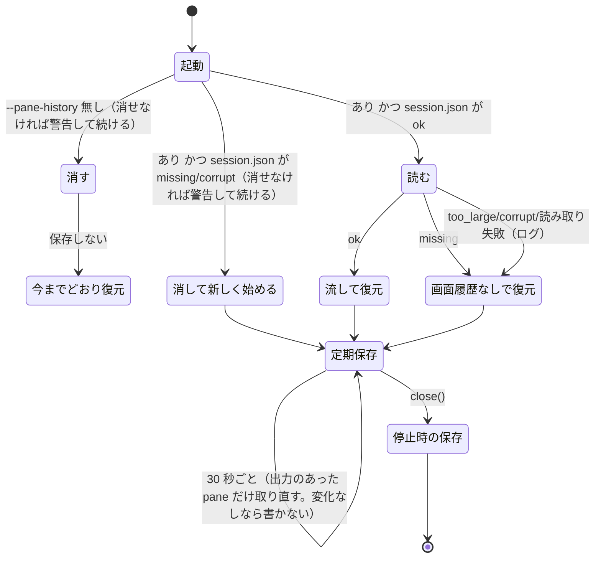

# 仕様: 画面履歴の保存と再生（opt-in）

## 概要

`wtm serve --pane-history` のときだけ、サーバが pane ごとのミラー（`@xterm/headless`）から**通常の画面とスクロールバック**を
ANSI（色・属性つき）で取り出し、状態ディレクトリの `session-history.json`（0600）に**定期的（30 秒ごと・出力のあった pane だけ取り直す）と
停止時**に保存する。起動し直したときは、`session.json` からの復元で pane の端末を作った直後（新しいシェルの出力より前）に、
保存した内容を**安全化してから**ミラーへ流し、その後ろに「前回のセッションの画面」の区切りの行を出す。ブラウザは接続時に
ミラーの直列化を受け取るので、そのまま前回の画面とスクロールバックが見える。フラグ無しで起動したときは `session-history.json` を消す。

## 設計方針

- **herdr と同じ骨格**（research F1）: 既定は無効、`session.json` の隣の別ファイル `session-history.json`、復元でシェルの起動前に端末へ流し込む、
  会話を再開する pane には流さない、無効にしたら消す、退避コピーに内容を残さない。
- **有効化は CLI フラグ**（decisions D1）。
- **保存の時機は session の保存と分ける**（decisions D2）: `persist.touch()` はフォーカスの変更でも走り、直列化は重い（research F5: 1 万行で約 100ms）。
  別の定期保存（30 秒）で、前回取り出した後に出力の無い pane は前回の結果を使い、何も変わっていなければ書かない。停止時は必ず取り直して書く。
- **流すのはミラーだけ**（research F6）: 復元の間は `/ws` を受け付けないので購読者はいない。ブラウザは接続時のミラーの直列化で受け取る。
- **安全化は許可リスト**（decisions D4・research F4）: 見た目とカーソルの移動・消去だけを残し、問い合わせ・モード・OSC・DCS・C1 を落とす。
  読み込み時に必ず通す（書き換えられたファイルでも応答が PTY へ行かない）。
- **区切りの行を足す**（herdr には無い。decisions D3）: 前回の画面と今のシェルの境目が分かるように。
- **取り違えを防ぐ**: `session.json` が無い・壊れていて新しく始めた起動では画面履歴を使わず消す（pane の id が `p1` から採番し直されるため）。

## 対象範囲

- 追加: `packages/server/src/terminal/historyAnsi.ts`（安全化・切り詰め・区切り）と `.test.ts`
- 追加: `packages/server/src/persist/PaneHistoryFile.ts`（`session-history.json` の読み書き・消去）と `.test.ts`
- 追加: `packages/server/src/session/PaneHistoryRecorder.ts`（取り出しと定期保存）と `.test.ts`
- 変更: `packages/server/src/terminal/Mirror.ts`（`historyAnsi()` を足す）と `Mirror.test.ts`、`Mirror` を実装する偽物
  （`agent/AgentMonitor.test.ts`・`terminal/OutputFanout.test.ts`）
- 変更: `packages/server/src/session/SessionService.ts`（`restore` の第 2 引数・`spawnForPane` で流し込む・再開の判定の共通化）と `SessionService.test.ts`
- 変更: `packages/server/src/config.ts`・`cliArgs.ts`（`--pane-history`）と各 `.test.ts`
- 変更: `packages/server/src/composeServer.ts`（読み込み・消去・定期保存の開始と停止時の保存）と `composeServer.integration.test.ts`
- 変更: `packages/server/src/startupBanner.ts`・`main.ts`（起動の表示）と `startupBanner.test.ts`
- docs: `docs/tls-setup.md`・`docs/verification.md`・`docs/herdr-parity.md`（H32）

## 依拠する既存の事実

- ミラーの直列化で `range` を渡すと通常バッファの指定行だけを最後のカーソルの位置合わせ無しで出し、`excludeModes` でモードを出さない
  （`@xterm/addon-serialize` 0.14.0 `src/SerializeAddon.ts:511-535`。research F2。実験 probe1）。
- 直列化の出力に現れる制御は SGR・`CSI n A/B/C/D/X`・CRLF だけ（同ファイル `:146,215-223,316-351,393-418`。research F2）。
- 幅の違う端末へ流すと折り返しの位置だけが変わる（research F3。実験 `scratchpad/research/probe1.txt`。直列化が折り返した行を改行無しで続けて出すため——
  同ファイル `SerializeAddon.ts` の `_rowEnd` の折り返しの扱い `:215-223`）。
- `excludeAltBuffer: true` は代替画面の中身（`CSI ? 1049 h` 以降）を足さない（同ファイル `:523-529`）。
- ミラーには既存の `plainText()`（通常バッファの平文）・`inputModes()`（bracketed paste・カーソルキーのモード）・`pendingBytes()`・`flush()` がある
  （`packages/server/src/terminal/Mirror.ts` の `Mirror` インターフェース）。テストの観測に `plainText()`・`inputModes()` を使う。
- ミラーは問い合わせに `onData` で応答し、`TerminalHost` がそれを PTY へ書く（`packages/server/src/terminal/Mirror.ts` `XtermMirror` のコンストラクタの
  `this.term.onData(...)`、`packages/server/src/terminal/TerminalHost.ts` の `this.mirror.onResponse((data) => this.pty.write(data))`。research F4）。
- `spawnForPane` は `this.terminals.create(...)` を同期で呼び、その後 `await raceSpawn(...)`（`packages/server/src/session/SessionService.ts` `spawnForPane`）。
  PTY の出力は非同期のイベントで届く（research F6。`TerminalHost.ts` のコンストラクタが `pty.onData(...)` の購読で受ける）。
- `/ws` は復元の後まで受け付けない（`packages/server/src/composeServer.ts` `listen()` の `wsServer.setReady(false)`→手順 5）。購読者はミラーの
  直列化を受け取る（`packages/server/src/terminal/OutputFanout.ts` の `this.mirror.serialize(entry.scrollbackLines)`）。
- `TerminalHost.lastOutputAt()` は PTY の出力のたびに `Date.now()` で更新（`TerminalHost.ts` の `pty.onData` の中の `this.lastOutput = Date.now()`）。
  `Mirror.flush()` はそれまでの書き込みの処理を待つ（`Mirror.ts`）。
- `TerminalManager.get(paneId)` は pane の `TerminalHost` を返し（無ければ undefined）、`create(...)` は作った `TerminalHost` を返す
  （`packages/server/src/terminal/TerminalManager.ts` の `TerminalManager` インターフェース）。`TerminalHost` は `mirror: Mirror`・`lastOutputAt()` を持ち、
  PTY の出力を `this.mirror.write(chunk)` でミラーへ書く（`TerminalHost.ts` の `TerminalHost` インターフェースとコンストラクタの `pty.onData`）。
  `Mirror.write(chunk, done?)` は `term.write` に渡す（`Mirror.ts` `XtermMirror.write`）。
- `TerminalManager` は PTY が終わると `hosts` から消して `dispose` する（`packages/server/src/terminal/TerminalManager.ts` の `host.onExit`）。
- `writeFileAtomic` は一時ディレクトリに書いて rename、POSIX は 0600、Windows では chmod しない（`packages/server/src/persist/atomicFile.ts` `writeFileAtomic`
  の `if (platform() !== "win32")`。コメント「Windows では効かないので、呼び出し側が保存場所（%LOCALAPPDATA% 等）で代える」）。既定の状態ディレクトリは
  Windows で `%LOCALAPPDATA%` の下（`packages/server/src/config.ts` `defaultStateDir`）。
- 会話の再開は `agentSession`・`getAutoResumeEnabled()`・`resumeCommandFor(kind, id)` が揃ったときだけ（`SessionService.maybeResumeAgentSession`）。
- 起動の順序（ロック → … → `sessionFile.load()`→`restore`/`ensureNotEmpty` → poller → `/ws`）と停止の順序（`/ws` 停止 → monitor・poller 停止 →
  `persist.flush()` → 全 pane の `terminals.dispose` → ロック解放）（`composeServer.ts` の `listen()`・`close()`。research F7）。
  `composeServer.ts` の既存の変数 `sessionLoaded` は、`restore` か `ensureNotEmpty` のどちらかを済ませた後に `true` になり、`close()` は `true` のときだけ
  `persist.flush()` する（`listen()` の手順 3 の後の `sessionLoaded = true`・`close()` の `if (sessionLoaded) await persist.flush()`）。
- CLI の解釈は `cliArgs.ts` の `parseArgs`（`--state-dir`・`--session`・`--json` 以外は `serveOnlyOptions` に入り `wtm token reset` では断る）、
  `config.ts` の `RawServeArgs`→`resolveServeOptions`→`ServeOptions`。誤りは `ConfigError`（`configError.ts`。終了コード 2）。使い方の文字列は `cliArgs.ts` の `USAGE`。
  起動の表示は `startupBanner.ts` `startupLines(info: StartupInfo)`（`main.ts` が `server.options` から組み立てて呼ぶ）。
- `session.json` の中身は `composeServer.ts` の `toSessionFileData` が組み立て、形は `persist/SessionFile.ts` の zod（既存のテスト `persist/SessionFile.test.ts`）。
- 起動に失敗した pane は `markPaneFailed` で `status: failed` になり、端末は `terminals.dispose` で消える（`SessionService.restorePaneProcess`・`spawnForPane`）。
- 上限の時間つき待ちの部品 `withTimeout(start, ms)`（`packages/server/src/session/withTimeout.ts`。上限・失敗で null）。

## インターフェース / データ構造

### `session-history.json`（`<状態ディレクトリ>/session-history.json`）

```ts
interface PaneHistoryFileData {
  schema: 1;
  savedAt: string;                 // ISO 8601（書いた時刻）
  panes: { paneId: string; savedAt: string; ansi: string }[];  // savedAt は その pane を取り出した時刻
}
```

- 鍵つきの object にしない（zod の `z.record` と `__proto__`。research「実装時の注意」）。同じ `paneId` が重なれば後ろが勝つ。
- `paneId` は 1〜64 文字。`ansi` は UTF-8 で `PANE_HISTORY_MAX_PANE_BYTES` 以下（超える項目があればファイルごと壊れている扱い）。

### `terminal/historyAnsi.ts`

```ts
export const PANE_HISTORY_MAX_PANE_BYTES = 2 * 1024 * 1024;       // pane ごと（ANSI の UTF-8 バイト数）
export function sanitizeHistoryAnsi(s: string): string;            // 許可リストで安全化（冪等）
export function truncateHistoryAnsi(s: string, maxBytes: number): string; // 超えたら古い側を行の境目で捨てる
export function historyReplayText(ansi: string, savedAt: string): string; // `ansi` ＋ 区切り（空なら ""）
```

- 安全化の許可リスト: 印字できる文字（U+0020 以上。U+007F と U+0080〜U+009F〔C1〕は除く）・`\r`・`\n`・`\t`・
  `ESC [ <0-9;:>* <A|B|C|D|X|m>`（中間文字なし）。それ以外の `ESC` で始まる並びは**並びごと**落とす:
  CSI（`ESC [` 引数 0x30–0x3F・中間 0x20–0x2F・終端 0x40–0x7E）、文字列型（`ESC ]`・`ESC P`・`ESC _`・`ESC ^`・`ESC X`。BEL か `ESC \` まで、無ければ末尾まで）、
  その他（`ESC` ＋中間 0x20–0x2F ＋終端 1 文字）。他の C0 は 1 文字ずつ落とす。
- 区切り: `ansi` の後ろに `\x1b[0m\r\n\x1b[2m--- 前回のセッションの画面（<ローカル時刻 YYYY-MM-DD HH:MM> に保存）---\x1b[0m\r\n`。
  `savedAt` が日付として読めなければ時刻を省いた文言。

### `Mirror.historyAnsi(): string`

通常バッファ（`term.buffer.normal`）の先頭から最後の空でない行まで（`translateToString(true) !== ""` を下から探す）を
`serialize({ range: { start: 0, end: last }, excludeAltBuffer: true, excludeModes: true })`。空でない行が無ければ `""`。

### `persist/PaneHistoryFile.ts`

```ts
export const PANE_HISTORY_FILE_NAME = "session-history.json";
export const PANE_HISTORY_MAX_FILE_BYTES = 64 * 1024 * 1024;
export interface PaneHistoryEntry { ansi: string; savedAt: string }
export type PaneHistoryLoadResult =
  | { kind: "ok"; panes: Map<string, PaneHistoryEntry> }   // ansi は安全化済み
  | { kind: "missing" }
  | { kind: "too_large"; bytes: number }
  | { kind: "corrupt"; reason: string };
export interface PaneHistoryFile {
  readonly path: string;
  load(): Promise<PaneHistoryLoadResult>;
  save(data: PaneHistoryFileData): Promise<void>;   // writeFileAtomic（0600）
  clear(): Promise<boolean>;                        // 消したら true・無ければ false
}
export class FsPaneHistoryFile implements PaneHistoryFile {
  constructor(stateDir: string, opts?: { maxFileBytes?: number });
}
```

- `load` は `stat` の大きさが上限を超えれば読まずに `too_large`。読めたら JSON＋zod。失敗は `corrupt`（退避コピーは作らない）。
  `ENOENT` は `missing`。それ以外の読み取りの失敗は投げる（呼ぶ側がログに残して画面履歴なしで続ける）。

### `SessionService`（変更）

```ts
restore(data: SessionFileData, opts?: { paneHistory?: ReadonlyMap<string, PaneHistoryEntry> }): Promise<void>;
private spawnForPane(paneId, cwd, command?, seed?: string): Promise<{ ok: boolean; alreadyExited: boolean }>;
private resumeCommandForRestore(agentSession: { kind: string; sessionId: string } | undefined): string | null;
```

### `session/PaneHistoryRecorder.ts`

```ts
export const PANE_HISTORY_SAVE_INTERVAL_MS = 30_000;
export interface PaneHistoryRecorderOptions {
  file: PaneHistoryFile;
  terminals: Pick<TerminalManager, "get">;
  paneIds: () => readonly string[];   // 保存する pane（モデルの順）
  logger: Logger;
  now?: () => number;                 // 既定 Date.now（lastOutputAt と同じ時計）
  maxPaneBytes?: number;              // 既定 PANE_HISTORY_MAX_PANE_BYTES
  maxFileBytes?: number;              // 既定 PANE_HISTORY_MAX_FILE_BYTES
  flushTimeoutMs?: number;            // 既定 1000
  // maxPaneBytes・maxFileBytes はテストで小さくするためのもの。既定より大きくしない（`load` は既定の上限で読む）。
}
export class PaneHistoryRecorder {
  start(intervalMs?: number): void;   // setInterval（unref）で save()
  stop(): void;
  save(opts?: { force?: boolean }): Promise<void>;  // 直列に並べる。投げない（失敗はログ）
}
```

## 振る舞いの詳細

### 保存（`PaneHistoryRecorder.save`）

1. 前の `save` が走っていれば終わるのを待ってから始める（直列）。
2. `paneIds()` の順に pane ごとに:
   - `terminals.get(id)` が無ければ取り出さない（前回のキャッシュがあればそれを使う）。
   - 前回の取り出し（キャッシュ）があり、`force` でなく、`host.lastOutputAt() < キャッシュの時刻` なら前回の結果を使う。
   - そうでなければ、時刻 `t = now()` を取り、`withTimeout(() => host.mirror.flush(), flushTimeoutMs)` を待ち、`host.mirror.historyAnsi()` を取り出し、
     `truncateHistoryAnsi(…, maxPaneBytes)` してキャッシュ（時刻 `t`・`savedAt = new Date(t).toISOString()`）。flush が上限を超えたら
     （pane が閉じて処理が返らない等）その pane は取り出さずに飛ばし、前回のキャッシュがあればそれを使う。取り出しが投げたときも同じ。
   - pane の間で `setImmediate` を 1 回待つ（イベントループを長く塞がない）。
   - 空の `ansi` は保存しない。
3. 今の pane の組にない id のキャッシュを捨てる。
4. どの pane も取り直さず、手順 5 で**実際に積む項目の組**（pane の id と取り出した時刻）も前回書いたときと同じで、前回の書き込みが成功していれば**書かない**（AC3「出力の無い間は書き直さない」）。
5. 項目を順に積み、`JSON.stringify` した項目のバイト数を足すと `maxFileBytes`（から枠の分 1KB を引いた値）を超える pane は**その pane だけ**積まずに
   次の pane へ進む（警告をログに 1 回）。（手順 4 の比較はこの手順で決まった組で行う。）
6. ファイル全体の `savedAt` は書く直前の `new Date(now()).toISOString()`。`file.save(...)`。失敗したら `logger.warn("pane history save failed", …)` して終わる（投げない。次回は書き直す）。

### 起動（`composeServer.listen()` の手順 3）

- `--pane-history` 無し: `paneHistoryFile.clear()`。消したら `logger.info("pane history disabled; removed session-history.json")`。
  消せなかったら警告のログ（起動は続ける）。復元は今までどおり（画面履歴なし）。
- `--pane-history` あり:
  - `session.json` が `ok` のとき: `paneHistoryFile.load()`。`ok` ならその `Map` を `session.restore(data, { paneHistory })` に渡す。
    `too_large`・`corrupt`・投げた場合は警告のログを残し、画面履歴なしで復元する（ファイルは次の保存で上書きされる）。
  - その `load()` が `missing` なら、画面履歴なしで復元する（ログは出さない。初めて有効にした起動）。
  - `session.json` が `missing`・`corrupt` のとき: `paneHistoryFile.clear()`（古い画面を新しい pane に取り違えない。AC5）→ `ensureNotEmpty()`。
  - どの経路でも、復元か `ensureNotEmpty()` を済ませて `sessionLoaded = true` にした後に `recorder.start()`（初回の起動を含む。AC1）。

### 復元（`SessionService.restore(data, opts?)`）

- `opts.paneHistory?.get(pane.id)` があり、その pane が会話を再開しない（`resumeCommandForRestore(agentSession) === null`）なら、
  `historyReplayText(entry.ansi, entry.savedAt)` を `spawnForPane` に渡す。
- `spawnForPane(paneId, cwd, command?, seed?)` は `this.terminals.create(...)` の直後、`await` の前に `host.mirror.write(seed)`（`seed` が空でなければ）。
- `resumeCommandForRestore(agentSession)` は `agentSession`・`getAutoResumeEnabled()`・`resumeCommandFor` の揃いを見る（`maybeResumeAgentSession` もこれを使う）。
- 起動が失敗した pane（`status: failed`）は端末が消えるので何も残らない（今までどおり）。

### 停止（`composeServer.close()`）

- `recorder` は `--pane-history` のときだけ作る（無ければ以下は何もしない）。`persist.flush()` の後、`terminals.dispose` の前に `recorder.stop()` →
  `sessionLoaded` なら `await recorder.save({ force: true })`（復元・`ensureNotEmpty` のどちらの経路でも）。

### 起動の表示

- `StartupInfo.paneHistoryPath?: string`。`main.ts` が `server.options.paneHistory` のとき `join(server.options.stateDir, PANE_HISTORY_FILE_NAME)` を渡す。あれば
  `wtm: 画面履歴を保存します（--pane-history）: <path>。pane の出力（秘密を含みうる）がディスクに残ります` を listening の行の後に出す。

### CLI

- `wtm serve --pane-history`（値なし）。`RawServeArgs.paneHistory?: boolean`・`ServeOptions.paneHistory: boolean`（既定 false）。
  `wtm token reset --pane-history` は既存の規則で `ConfigError`。`USAGE` に `[--pane-history]` を足す。



## ドメイン固有の考慮

- 秘密: 既定は無効・無効で起動したら消す・0600・状態ディレクトリの直下だけ（パスは `stateDir` と固定の名前。外からの入力を使わない）・
  退避コピーを作らない・起動の表示で保存していることを知らせる。
- 名前付き session（20260926-named-session）: `stateDir` はその session の状態ディレクトリなので、画面履歴も session ごとに分かれる。
  `wtm session delete` はディレクトリごと消すので画面履歴も消える。
- Windows: `writeFileAtomic` の既存の扱い（権限の代わりに `%LOCALAPPDATA%`）に従う。
- 代替画面: 取り出しは常に通常バッファ（research F2）。代替画面の中身（vim 等）は保存しない。
- herdr との違い（docs に書く）: ① CLI フラグ（設定ファイル・設定画面ではない）② 区切りの行 ③ 流す前の安全化 ④ 保存は 30 秒ごとと停止時
  （herdr は session の保存ごと）⑤ `session.json` が無い・壊れていたら画面履歴を消す ⑥ 大きさの上限。

## エラー処理 / 異常系

- 保存の失敗（書けない・ディスクが一杯）: 警告のログ。`session.json` の保存・停止は続く（AC13）。
- 読み込み: 大きすぎる・壊れている・読み取りの失敗 → 警告のログ、画面履歴なしで復元（AC7）。
- 消去の失敗 → 警告のログ、起動は続ける。AC5 の経路で消せなかった場合も続ける: 消すにも `session.json` を書くにも同じ状態ディレクトリへの
  書き込みが要る（unlink はディレクトリの書き込み権、`writeFileAtomic` は同じディレクトリでの rename）ので、消せない状態では `session.json` も
  書けず、次の起動でも `session.json` が無い（AC5 の経路をもう一度通り、流さない）。decisions D6。
- 取り出しの途中で pane が閉じた（`flush` が返らない・投げる）→ 上限つきで待ち、その pane を飛ばす（前回のキャッシュがあればそれを使う）。
- 同じ id が 2 度 → 後ろが勝つ。保存にあってモデルに無い id → 使わない。

## 受け入れ基準との対応

- AC1: 入力は PTY の出力 → ミラー（`TerminalHost` が `mirror.write`）。停止時の `recorder.save({ force: true })` が `Mirror.historyAnsi()`
  （通常バッファ。代替画面の中でも通常の側）を `session-history.json` に書く。結合テスト（実 PTY で `printf` の色付きの出力→`close()`→ファイルを読む）と
  `Mirror.test`（代替画面の中での取り出し）。
- AC2: 入力は `session-history.json`（AC1 で書いたもの）と `session.json`。`listen()` が読んで `restore(data, { paneHistory })` →
  `spawnForPane` が `create` の直後にミラーへ `historyReplayText(...)`。結合テスト（2 つ目の `composeServer` の pane のミラーの `plainText()` で、
  保存した文字・区切りの行・新しいシェルの出力の順を確かめる）と `SessionService.test`（`create` の直後・他の書き込みの前に流す）。色は
  `historyAnsi.test`/`Mirror.test` で SGR が残ることを確かめる。
- AC3: 入力は `TerminalHost.lastOutputAt()` と時計。`PaneHistoryRecorder.start()` の定期保存と、変化なしなら書かない判定。`PaneHistoryRecorder.test`（偽の時計・偽のタイマー）。
- AC4: 入力は `ServeOptions.paneHistory`（`--pane-history` の有無）。無しなら `recorder` を作らず、`listen()` で `clear()`。結合テスト。
- AC5: 入力は `sessionFile.load()` の結果。`missing`/`corrupt` なら `clear()` して流さない。結合テスト。
- AC6: 入力は `stateDir` と固定の名前。`FsPaneHistoryFile` が `writeFileAtomic`（0600）。`PaneHistoryFile.test`（POSIX で mode を確かめる）。
- AC7: 入力は取り出した ANSI・ファイルの大きさ・中身。`truncateHistoryAnsi`・`save` の合計の上限・`load` の `too_large`/`corrupt`。
  `historyAnsi.test`・`PaneHistoryRecorder.test`・`PaneHistoryFile.test`・結合テスト（壊れたファイルでも起動する）。
- AC8: 入力は書き換えた `session-history.json`。`load` が `sanitizeHistoryAnsi` を通す。`historyAnsi.test`（落とす並びの一覧）と `Mirror.test`
  （安全化した内容を実物の `XtermMirror` に流して `onResponse` が 0 件・`inputModes()` が変わらない）。
- AC9: 入力は保存した `agentSession` と `getAutoResumeEnabled()`。`resumeCommandForRestore` が null でなければ流さない。`SessionService.test`。
- AC10: 入力は本 design の「ドメイン固有の考慮」（herdr との違い）と CLI の仕様。docs 3 つ（`docs/tls-setup.md`・`docs/verification.md`・`docs/herdr-parity.md` H32）。
- AC11: 入力は `ServeOptions.paneHistory` と `stateDir`（`main.ts` が `paneHistoryPath` に組み立てる）。`USAGE` と `startupLines` の行。`cliArgs.test`・`startupBanner.test`。
- AC12: 入力は `paneHistory` の Map に無い pane。`spawnForPane` に `seed` を渡さない（区切りも出さない）。`SessionService.test` と結合テスト（保存の後に作った pane）。
- AC13: 入力は `file.save` の失敗。`save` はログに残して投げない。`close()` は続く。`PaneHistoryRecorder.test`（失敗する偽のファイル）と、
  `session.json` の形式は `toSessionFileData` を変えないこと（既存の `SessionFile.test`・差分で確認）。
