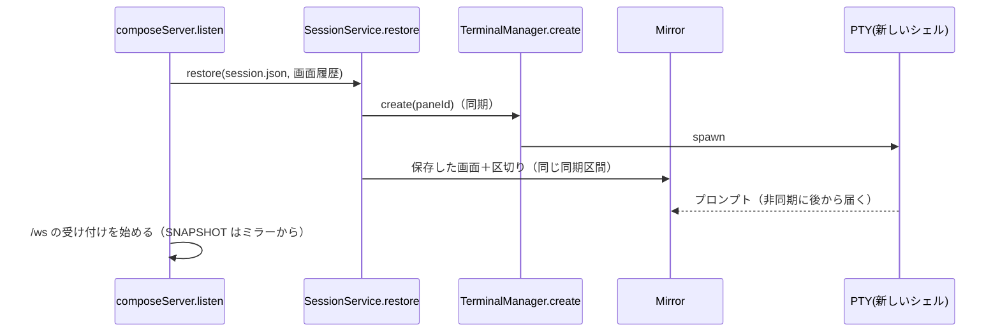

# 調査: 画面履歴の保存と再生

requirements 終了時の判定（protocol.md「4.5」）: **未検証の既存挙動に依存する**（ミラーの直列化を別の端末へ流したときの
再現・幅が違うときの折り返し・流し込んだ内容への端末の応答）と**影響が横断的**（persist・session・terminal・CLI）に当たるので実施した。
実験の生の出力は `scratchpad/research/probe1.txt`・`probe2.txt`（コミットしない）。

## 調査の問い

- Q1: herdr は画面履歴をどう保存し、どう流し直すか（形式・時機・除外・無効化）。
- Q2: サーバのミラー（`@xterm/headless` 6.0.0＋`@xterm/addon-serialize` 0.14.0）から「通常の画面とスクロールバックだけ」を、
  カーソルの位置合わせやモードを含めずに取り出せるか。代替画面の中でも通常の側を取れるか。
- Q3: 取り出した内容を、幅の違う新しい端末へ流すと見た目はどうなるか。
- Q4: 流し込む内容に端末への問い合わせが混じると何が起きるか（安全化の要否）。
- Q5: 直列化・流し込みの費用（保存の頻度と上限を決める材料）。
- Q6: 復元の順序で、新しいシェルの出力より先に流し込める場所はどこか。
- Q7: 保存の既存の仕組み（書き方・権限・壊れたファイル）と、起動・停止の順序。

## 判明した事実

- F1（Q1）: herdr v0.9.1。
  - 設定 `[experimental] pane_history`（既定 false。`src/config/model.rs:1043-1044`・テスト `pane_history_persistence_is_opt_in` `:1986`）。
    docs は「秘密・token・プロンプト・コマンドの出力を含みうるので既定で無効」（`docs/versions/0.9.1/.../session-state.mdx`「Pane screen history replay」）。
  - 保存先は `session.json` の隣の `session-history.json`（`src/persist/writer.rs:43`・`src/persist/io.rs:14-15`）。session の保存のたびに
    設定が有効なら一緒に書く（`src/app/session.rs:51-53`）。history の保存の失敗は session の保存の成否に影響させない（`writer.rs:41-47` のコメント）。
  - 取り出すのは `recent_unwrapped_ansi(usize::MAX)`（折り返しを戻した ANSI。空白だけなら保存しない。`src/pane.rs:3252-3255`）。
  - 復元では新しい端末へシェルの起動前に `seed_history_ansi`（端末へそのまま write。`src/pane/terminal.rs:1572-1586`・`src/pane.rs:2300-2302`）。
  - 公式連携で会話を再開する pane には流さない（`src/persist/restore.rs:739-780` `pane_restore_startup`）。
  - 設定を無効にすると `session-history.json` を消す（`src/app/mod.rs:879-882`）。壊れた session の退避コピーは画面履歴を含まない（docs 同節）。
  - 区切りの行・見た目の区別は無い（`seed_history_ansi` はそのまま書くだけ）。
- F2（Q2）: `SerializeAddon.serialize({ range, excludeAltBuffer: true, excludeModes: true })` は、`range` があると
  **通常バッファ（`buffer.normal`）の指定行だけ**を、**最後のカーソルの位置合わせを付けずに**直列化する
  （`node_modules/.pnpm/@xterm+addon-serialize@0.14.0/.../src/SerializeAddon.ts:511-535`。`range` 指定時は `_serializeBufferByRange(..., true)`）。
  代替画面が有効でも `buffer.normal` を読む（実験 probe1: 代替画面の中で取り出して `active: alternate` でも通常の側の行だけが出た）。
  出力に現れる制御は SGR（`CSI … m`）とカーソルの移動・消去（`CSI n A/B/C/D/X`）と CRLF だけ（同ファイル `:146,215-223,316-351,393-418`）。
  モード（`CSI ? … h` 等）は `excludeModes` で出ない（`:531` `_serializeModes`）。
- F3（Q3）: 20 桁の端末で折り返した 45 文字の行は、直列化では改行を挟まずに続けて出る（折り返しは端末の幅任せ）。30 桁の端末へ流すと
  30＋15 に、10 桁の端末へ流すと 10×4＋5 に折り返し直る（probe1）。つまり**幅の違いは折り返しの位置が変わるだけで、行の区切りは保たれる**。
  空の行は空の行として残る。
- F4（Q4）: `@xterm/headless` は流し込んだ `ESC [ c`（DA1）・`ESC [ 6 n`（CPR）に `onData` で応答を出す（probe1 `responses ["\u001b[?1;2c","\u001b[1;1R"]`）。
  本製品のミラーは `onData` の応答を PTY へ書き戻す（`packages/server/src/terminal/TerminalHost.ts` の `this.mirror.onResponse((data) => this.pty.write(data))`、
  `Mirror.ts` の `this.term.onData((data) => this.emitResponse(data))`）。**保存ファイルに問い合わせが混じっていれば、新しいシェルへの入力になる**。
  色の問い合わせ（OSC 4/10/11/12）・明暗（`CSI ? 996 n`）にも応答する（`Mirror.ts` の `registerOscHandler`・`registerCsiHandler`）。→ 流す前の安全化が要る。
- F5（Q5）: 120 桁・10,040 行（色付き）の直列化は約 103ms・約 1.2MB、それを新しい端末へ流すのは約 38ms（probe2。この共有マシンでの 1 回の実測）。
  `--scrollback` の既定は 5,000 行・上限 10,000 行（`packages/server/src/config.ts` `DEFAULTS`）。pane が 16 あって全部が上限まで埋まっていると、
  全部を一度に直列化すると 1.6 秒ほどイベントループを塞ぐ。
- F6（Q6）: 復元は `SessionService.restore` → pane ごとに `restorePaneProcess` → `spawnForPane`（`packages/server/src/session/SessionService.ts`）。
  `spawnForPane` は `this.terminals.create(...)`（同期。PTY の起動とミラーの作成）の直後に `await raceSpawn(...)`（起動の猶予）へ進む。
  node-pty の出力は非同期のイベントで届くので、`create` が返った**同じ同期区間の中で**ミラーへ書けば、新しいシェルの出力より前に並ぶ
  （xterm の write は順に処理される。`Mirror.flush` のコメント「空の書き込みのコールバックは、それより前の書き込みを全部処理した後」）。
  復元の間は `/ws` を受け付けない（`composeServer.ts` の `wsServer.setReady(false)` → 復元の後に `true`）ので、流し込みの時点で購読者はいない。
  購読者はつないだときにミラーの直列化（`OutputFanout` の `this.mirror.serialize(...)`）を受け取るので、**ミラーにだけ書けばブラウザにも出る**。
- F7（Q7）: 書き込みは `writeFileAtomic`（一時ディレクトリに書いて rename。POSIX は 0600。`packages/server/src/persist/atomicFile.ts`）。
  壊れたファイルの扱い `readFileWithBackup` は `*-backups/` へ退避コピーを作る（画面履歴には使わない——F1 の herdr と同じく退避に内容を残さない）。
  起動の順序は `composeServer.listen()`：ロック → auth → bind → token → report socket → `sessionFile.load()`→`restore`/`ensureNotEmpty` →
  poller → `/ws` の受け付け。停止は `close()`：`/ws` を止める → monitor・poller を止める → `persist.flush()` → 全 pane の `terminals.dispose` → ロックを放す。
  `session.json` の保存は `persist.touch()`（モデルの変更。フォーカスの変更でも）から 500ms まとめて。出力では保存しない。
- F8: 公式連携の自動再開は、保存した `agentSession` と `getAutoResumeEnabled()` と `resumeCommandFor(kind, id)` が揃ったときだけ
  シェルの起動の後に再開のコマンドを書く（`SessionService.maybeResumeAgentSession`）。
- F9: サーバには設定ファイルの機構が無く、サーバ全体の指定は CLI フラグ（`packages/server/src/cliArgs.ts` の `switch`・`config.ts` の
  `RawServeArgs`/`ServeOptions`/`resolveServeOptions`）。起動の表示は `startupBanner.ts` の `startupLines`（純関数）を `main.ts` が出す。

## 影響範囲

- `packages/server/src/config.ts`・`cliArgs.ts`（新しいフラグ）、`composeServer.ts`（読み込み・消去・定期保存・停止時の保存）、
  `session/SessionService.ts`（復元で流し込む）、`terminal/Mirror.ts`（取り出し）、`persist/`（新しいファイル）、`startupBanner.ts`・`main.ts`（表示）。
- `session.json` の形式・protocol・web は変えない。

## 実現性 / リスク

- 実現可能（F2・F3・F6）。
- 安全化は必須（F4）。SGR とカーソルの移動・消去（`CSI [0-9;:]* [ABCDXm]`）・CR・LF・印字できる文字だけを残せば、直列化の出力（F2）は
  そのまま通り、問い合わせ・モード・OSC は落ちる。
- 費用（F5）: 保存を pane ごとに分けて間に他の処理を挟む・出力の無い pane は前回の結果を使う、で塞ぐ時間を抑える。
- 流し込んだ画面はミラーの中身になるので、`wtmctl pane read`・エージェントの画面の判定（`AgentMonitor` がミラーの下の行を読む）からも見える。
  区切りと新しいプロンプトが後ろに来るので、下の行は新しいシェルになる。

## 実装アンカー

- A1: 取り出し（`packages/server/src/terminal/Mirror.ts` `XtermMirror.serialize` の隣）— `serializeAddon.serialize({ range, excludeAltBuffer, excludeModes })`。
  最後の空でない行は `this.term.buffer.normal` を下から `translateToString(true)` で探す（`plainText()` と同じ読み方）。
- A2: 流し込み（`packages/server/src/session/SessionService.ts` `spawnForPane` の `this.terminals.create(...)` の直後）。
- A3: 会話の再開の判定（同 `maybeResumeAgentSession`）。流すかどうかを起動の前に同じ条件で決める。
- A4: 保存ファイル（`packages/server/src/persist/` に新しく。`SessionFile.ts`・`IntegrationFile.ts` と同じ zod＋`writeFileAtomic`）。
- A5: 起動・停止（`packages/server/src/composeServer.ts` の `listen()` 手順 3 と `close()` の `persist.flush()` の後・`terminals.dispose` の前）。
- A6: フラグ（`packages/server/src/cliArgs.ts` の `switch`・`USAGE`、`config.ts` の `RawServeArgs`・`ServeOptions`・`resolveServeOptions`）。
- A7: 起動の表示（`packages/server/src/startupBanner.ts` `startupLines`・`main.ts` の呼び出し）。
- A8: テストの足場（`session/SessionService.test.ts` の `FakeTerminalManager`/`FakeTerminalHost`。`mirror` は `plainText` だけの偽物。
  `composeServer.integration.test.ts` の「persists and restores the session across two composeServer instances (AC18)」が実 PTY の再起動の往復）。

## 実装時の注意

- `FakeTerminalHost.mirror` は `plainText` しか持たない偽物（`as unknown as`）。流し込みで `mirror.write` を呼ぶなら偽物に足す。
- `Mirror` のインターフェースに足すと、`Mirror` を実装する偽物（テスト）すべてに影響する。`grep "implements Mirror\|as unknown as TerminalHost\[\"mirror\"\]"` で確かめる。
- zod の `z.record` は `__proto__` のような鍵で既定の Object に代入するので、pane の id を鍵にした object ではなく配列（`{ paneId, ansi }[]`）で持つ。
- `pnpm -s` は失敗を隠しうる（終了コードで判断）。

## design への申し送り

- 保存の時機: herdr は session の保存ごとだが、本製品の `persist.touch()` はフォーカスの変更でも走り、直列化は重い（F5）。
  session の保存とは別の定期保存（出力のあった pane だけ直列化し直す）と、停止時の保存に分ける。
- 取り違え: pane の id は `nextId` で採番し直さない限り再利用されない。`session.json` が無い・壊れて新しく始めた起動では、古い画面履歴を消す
  （`p1` が再び使われうる）。
- 区切り: herdr には無い。requirements F3 のとおり足す（herdr との違いとして docs に書く）。
- 上限・間隔の値と、ファイル全体の上限を超えたときの扱い。
