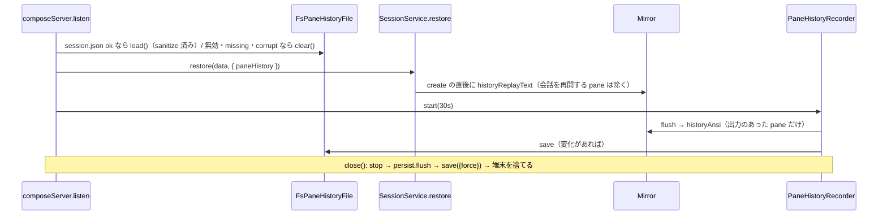

# レビューガイド: 画面履歴の保存と再生（`--pane-history`）

## 変更概要 / 目的

herdr の pane screen history に当たる opt-in の機能。`wtm serve --pane-history` のときだけ、各 pane の通常の画面とスクロールバック（色つき ANSI）を
状態ディレクトリの `session-history.json`（0600）に保存し、再起動後の復元で新しいシェルより前にミラーへ流して「前回のセッションの画面」の区切りを出す。
付けずに起動すると消す。`session.json` の形式・protocol・web は変えていない。

## 重要ポイント

- **流し込みの順序**は `SessionService.spawnForPane` が `terminals.create` と同じ同期区間で `host.mirror.write(seed)` することだけで保証している
  （PTY の出力は非同期で届く。research F6）。ブラウザは接続時にミラーの直列化を受け取るので、fanout には流さない。
- **安全化**（decisions D4）: ミラーは問い合わせに答えて PTY に書くので、読み込み時に許可リスト（文字・CR/LF/TAB・`CSI [0-9;:]* [ABCDXm]`）で落とす。
- **取り違え防止**: `session.json` が無い・壊れていれば画面履歴を消す（pane の id が p1 から振り直されるため）。消せない場合は D6。
- **保存の時機**は `session.json` と別（D2）: 30 秒ごとに出力のあった pane だけ取り直し、内容が同じなら書かない（D8）。停止時は必ず書く。
- `clear()` は起動時に本体を先に消し、`writeFileAtomic` の形で 10 分より古い `.tmp-*` だけを片付ける（D8）。

## 処理フロー

## 主要な変更箇所

- `packages/server/src/terminal/historyAnsi.ts` — 安全化・切り詰め・区切りの行
- `packages/server/src/terminal/Mirror.ts` `historyAnsi()` — 通常バッファの最後の空でない行まで、モードとカーソルの位置合わせ無し
- `packages/server/src/persist/PaneHistoryFile.ts` — 読み書き・上限・corrupt（退避しない）・clear
- `packages/server/src/session/PaneHistoryRecorder.ts` — 定期・停止時の保存、直列、失敗はログ
- `packages/server/src/session/SessionService.ts` `restore`・`spawnForPane`・`resumeCommandForRestore`
- `packages/server/src/composeServer.ts` `loadPaneHistory`・`clearPaneHistory`・`listen()`・`close()`

## リスク / 確認したい点

- 120 桁より広い端末で保存した行の空白の詰まり・巨大な 1 論理行の切り詰め（D7。既知の制約・backlog）。
- 異常終了では最後の 30 秒ぶんが戻らない。流した画面は `wtmctl pane read` やエージェントの画面判定からも見える（区切りと新しいプロンプトが下に来る）。
- Windows ネイティブ・macOS・ブラウザでの見た目は未検証（E2E 未実行）。
