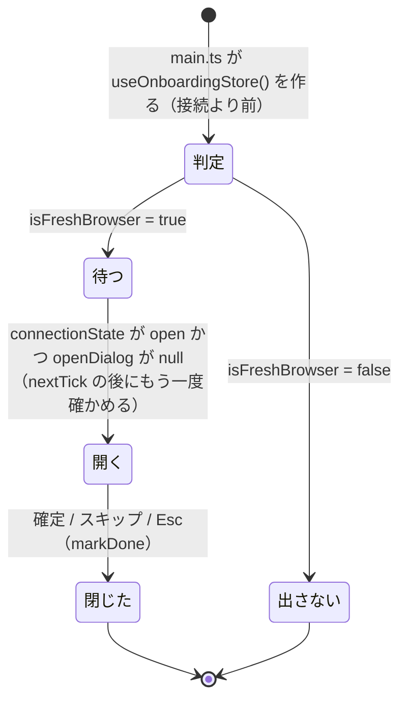

# 仕様: 設定の onboarding（初回の案内。H25b）

## 概要

新しいダイアログ「はじめの案内」（`OnboardingDialog.vue`）を足す。起動時に 1 回だけ「このブラウザに本製品を使った痕跡が無いか」を
判定し（`store/onboarding.ts`）、無ければ接続が最初に開いたあとで案内を開く。案内は製品の一言・主要な操作の入口（現在の割り当て）・
テーマ・キーのプリセット・通知の選択を 1 枚に並べ、［この設定ではじめる］で**変えたものだけ**を既存のストアの setter で反映し、
［スキップ］・Esc では何も反映しない。どちらでも `wtm.prefs.v1` に `onboarding: false`（herdr の設定名と値に合わせる）を書いて以後出さない。
設定画面に［はじめの案内を開く］を置き、いつでも開き直せる。

## 設計方針

- **既存のダイアログの形をそのまま使う**（research F1・F2）: ネイティブ `<dialog>` ＋ `showModal()`、`view.dialogContext` の watch で開閉、
  `cancel` を `preventDefault()` して自前で閉じる。モーダルの入力の遮断は `KeyRouter` の `"dialog"` モードと `<dialog>` の inert に任せる
  （F3。新しい遮断の仕組みを作らない）。
- **選択は下書きで持ち、確定で反映する**（requirements AC-I2・AC4）。設定画面の「押した時点で効く」（switch）とは流儀が違うので、
  通知の選択は `role="switch"` ではなくネイティブの checkbox にする（APG の switch は「即座に効く」もの。`SettingsDialog.vue:34-37` の
  理由付けの裏返し）。テーマのプレビューはしない（decisions D3）。
- **変えたものだけ反映する**: 確定時、下書きが**開いたときの下書きの初期値**（`initial`。テーマ・通知とも同じ基準）と違う項目だけ setter を呼ぶ。開き直して何も変えずに確定しても
  保存値は動かない（特に `setTheme` は `themeAuto` を切るので、変えていないのに呼ぶと自動の切替が外れる。`store/settings.ts:323-327`）。
- **痕跡の判定は起動時に 1 回・localStorage を直接読む**（research F9・F10）。`readPrefs` は「読めない」と「空」を区別しないので使わない。
- **開く時機は「接続が最初に open になった後」**（research F4・F6）。端末にフォーカスが入ったあとに `showModal()` するので、閉じたときに
  ネイティブの `<dialog>` が端末へフォーカスを戻す。

## 対象範囲

- 追加: `packages/web/src/store/onboarding.ts`（判定の純粋関数とストア）・`packages/web/src/store/onboarding.test.ts`
- 追加: `packages/web/src/components/OnboardingDialog.vue`・`packages/web/src/components/OnboardingDialog.test.ts`
- 変更: `packages/web/src/store/view.ts`（`DialogContext` に `{ kind: "onboarding" }`、痕跡のキーの定数を export）
- 変更: `packages/web/src/store/seen.ts`（キーの定数を export）
- 変更: `packages/web/src/components/Toast.vue`（キー一覧の案内のキーを `store/view.ts` の定数から読む。値は変えない）
- 変更: `packages/web/src/notify/NotificationController.ts`（OS 通知の案内を外から「答えた」にする公開メソッド）
- 変更: `packages/web/src/components/SettingsDialog.vue`（［はじめの案内を開く］）
- 変更: `packages/web/src/App.vue`（`<OnboardingDialog />` を置く）
- 変更: `packages/web/src/main.ts`（ストアを接続より前に作る）
- 変更: `docs/herdr-parity.md`（H25b 行）・`docs/verification.md`

## 依拠する既存の事実

- ダイアログの開閉は `view.openDialogWithContext`/`closeDialog`（`store/view.ts:347-368`）、種類は `DialogContext`（`store/view.ts:168-211`）。
- `openDialog` が非 null の間 `KeyRouter` は `"dialog"` モード、window の keydown 経路は何もしない（`main.ts:265-278`）。
- `Connection` は `applySnapshot` → `onConnectionState("open")` の順（`net/Connection.ts:239-242`）。`restoreView` が `focusedPaneId` を
  直接書く（`store/view.ts:308-322`）。`TerminalPane` は mount と `focusedPaneId` の変化で `term.focus()`（`components/TerminalPane.vue:41-47,62-68`）。
- ネイティブ `<dialog>` は閉じると開く直前のフォーカスへ戻し、modal の間は背景が inert（HTML の dialog 要素。research F13。
  happy-dom での再現は未確認→テストでは確かめない）。
- 痕跡: `wtm.prefs.v1`（`store/view.ts:47`）・`wtm.hint.prefixHelp.v1`（`components/Toast.vue:14`。初回の pane フォーカスで書かれる `:35-45`）・
  `wtm.seen.v1`（`store/seen.ts:5`）。`wtm.themeBoot.v1` は起動のたびに書かれるので使えない（`theme/ThemeController.ts:12,158`、`main.ts:180`）。
- 反映の入口: `settings.setTheme`（`store/settings.ts:323-327`）、`applyRecommended`（`keys/assign.ts:303`）＋`settings.replaceKeyPrefs`
  （`store/settings.ts:376-387`）、`KEY_PRESETS`（`keys/presets.ts:44-51`）、`notifications.setPrefs`（`store/notifications.ts:67-71`）。
- OS 通知: `controller.desktopPermission()`/`requestDesktopPermission()`/`unlockSound()`（`notify/NotificationController.ts:370-382`）。
  許可の値は `"default" | "granted" | "denied" | "unsupported"`（`notify/ports.ts:13`）。設定画面の状態の分け方は `SettingsDialog.vue:80-85`。
  OS 通知の案内の消費は private の `#consumeHint`（`NotificationController.ts:361-367`）。
- 現在の割り当ての表記は `settings.keymap.hintFor(id)`（割り当てが無ければ null。`keys/keymap.ts:166-173`）と `settings.keymap.prefix`
  （`HelpDialog.vue` の「全体」群）。
- サイドバーの全体メニューに「キー割り当て」「設定」がある（`components/ContextMenu.vue:111-116`）。モバイルは上のバーの［設定］
  （`mobile/MobileShell.vue:87`）。
- 端末の種類は `inject(DeviceKindKey, "desktop")`（`SettingsDialog.vue:49-55`）。
- `writePrefs` は現在の保存値に併合して書き、失敗は握りつぶす（`store/view.ts:67-73`）。
- `applyRecommended` の戻り値は `{ prefs, added, already, skipped }`（`keys/assign.ts:285-296` `RecommendedResult`）。
- `notifications.desktopUsable`/`soundUsable`（`store/notifications.ts:55,64`）。設定画面の OS 通知の区分と注記は `SettingsDialog.vue:80-98`
  （`desktopState`/`desktopNote`）。設定画面の寸法は `SettingsDialog.vue:916-925`（`.settings-dialog` の `max-width`/`max-height`）。
- `THEME_NAMES` は `@wtm/protocol`（`packages/protocol/src/theme.ts`）、`THEME_LABELS` は `theme/themes.ts:9`。
- `view.connectionState`（`store/view.ts:272`）は `onConnectionState`（`store/view.ts:456-458`）で書かれ、`Connection` が `client.hello` の
  結果を受けて `applySnapshot` の直後に `"open"` を渡す（`net/Connection.ts:239-242`）。
- `settings.keymap.prefix` を「全体」群の先頭に出す先例は `HelpDialog.vue` の `helpGroups`（`{ keys: settings.keymap.prefix, … }`）。

## インターフェース / データ構造

### `store/view.ts`

```ts
export const PREFS_KEY = "wtm.prefs.v1";                          // 既存の定数を export に変える
export const PREFIX_HELP_HINT_KEY = "wtm.hint.prefixHelp.v1";     // Toast.vue から移す（値は同じ）
export type DialogContext = … | { kind: "settings" } | { kind: "onboarding" };
```

### `store/seen.ts`

```ts
export const SEEN_STORAGE_KEY = "wtm.seen.v1"; // 既存の STORAGE_KEY を export 名で出す（値は同じ）
```

### `store/onboarding.ts`（新規）

```ts
/** 読むだけの面（テストで偽物を渡す）。null は localStorage を取れない環境。 */
export type ReadableStorage = Pick<Storage, "getItem">;

/**
 * このブラウザに本製品を使った痕跡が無いか。true のときだけ案内を出す。
 * - `wtm.prefs.v1` が無い、または JSON のオブジェクトでキーが 0 個
 * - かつ `wtm.hint.prefixHelp.v1` が無い
 * - かつ `wtm.seen.v1` が無い
 * storage が null・getItem が throw・prefs が壊れた JSON／オブジェクト以外 → false（出さない側）。
 */
export function isFreshBrowser(storage: ReadableStorage | null): boolean;

export const useOnboardingStore = defineStore("onboarding", () => {
  /** 起動時の判定（ストアを作った時点で 1 回だけ）。 */
  const pendingAtStartup: Ref<boolean>;
  /** この読み込みで起動時の案内を開いたか（2 回開かない）。 */
  const startupOpened: Ref<boolean>;
  function markStartupOpened(): void;
  /** 案内済みにする（`pendingAtStartup = false` にし、`writePrefs({ onboarding: false })`）。確定・スキップのどちらでも呼ぶ。 */
  function markDone(): void;
});
```

`localStorage` の取得は `main.ts:171-178` と同じく取得そのものを try/catch する（`window.localStorage` が throw する環境がある）。

### `NotificationController`

```ts
/** OS 通知の案内に答えた扱いにする（案内を確定したとき毎回。案内には通知の選択が常にあるので、確定＝通知について答えた）。出ていれば消し、以後出さない。 */
markHintAnswered(): void; // 中身は #consumeHint() を呼ぶだけ
```

### `OnboardingDialog.vue`（新規）

- `inject(NotificationControllerKey)`（無ければ throw。`SettingsDialog.vue:42-44` と同じ）、`inject(DeviceKindKey, "desktop")`。
- 下書き: `theme: ThemeName`・`preset: "none" | KeyPreset["id"]`・`toast`/`desktop`/`sound: boolean`。開くたびに現在値から作り、同じ値を
  `initial` として控える（`theme = settings.theme`、`preset = "none"`、通知は `notifications.prefs`。`desktop` は `prefs.desktop && permission === "granted"`）。

## 振る舞いの詳細

### 起動時の判定と開く時機



- `OnboardingDialog.vue` が `watch(() => [onboarding.pendingAtStartup, onboarding.startupOpened, view.connectionState, view.openDialog], …, { immediate: true })`
  で見る。条件（`pendingAtStartup` かつ `!startupOpened` かつ `connectionState === "open"` かつ `openDialog === null`）がそろったら `nextTick` の後に
  条件をもう一度確かめ、そろっていれば `markStartupOpened()` → `view.openDialogWithContext({ kind: "onboarding" })`。そろわなければ何もせず、
  次に条件が変わったとき（ほかのダイアログが閉じた・再接続した）の watch で再び試す。
- 1 回の読み込みで起動時に開くのは 1 回（`startupOpened`）。確定もスキップもせずにタブを閉じたら、案内済みにならないので次の読み込みでまた出る。

### 中身（上から）

1. 見出し `<h2 id="onboarding-title" tabindex="-1">wtm へようこそ</h2>` と一言（コーディングエージェントのための、ブラウザで使う端末のワークスペース）。
2. マウスの操作（デスクトップ）: サイドバーのクリックで切り替え・pane の境界のドラッグで大きさ・右クリックでメニュー（herdr の 3 行に対応）。
   モバイル: 上のバーで pane を選び、［設定］から設定を開ける。
3. キー（デスクトップのみ）: `prefix（{settings.keymap.prefix}）を押してから次のキーで操作します`・`{hintFor("help")} でキー一覧`・
   `{hintFor("settings")} で設定`。`hintFor` が null の操作は「キー一覧はサイドバーの［メニュー］→「キー割り当て」から」「設定は
   サイドバーの［メニュー］→「設定」から」と書く（AC7）。
4. テーマ: `<label>` 付きの `<select>`（`THEME_NAMES`・`THEME_LABELS`。設定画面と同じ並び）。
5. キーのプリセット（デスクトップのみ。decisions D5）: `<fieldset><legend>` の radio 群（「使わない」＋ `KEY_PRESETS` の各 `label`）。
6. 通知: `<fieldset><legend>` の checkbox 3 つ（トースト・OS 通知・音）。OS 通知は許可が `"denied"`/`"unsupported"` または
   `notifications.desktopUsable === false` なら `disabled` にし、理由を 1 行添える（設定画面の `desktopNote` と同じ区分）。
   音は `notifications.soundUsable === false` なら `disabled`。
7. 次の一歩: 「エージェント連携（会話の自動再開）は設定の『エージェント連携』で入れられます。」（herdr の next 行に対応。導入はさせない）
8. 注記: 「選んだ内容はこのブラウザにだけ残ります。あとから設定で変えられ、この案内も設定から開き直せます。」
9. ボタン: ［スキップ］（`type="button"`）・［この設定ではじめる］（主ボタン）。

### 開く・閉じる・フォーカス

- `dialogContext.kind === "onboarding"` になったら下書きを現在値で作り直し、`nextTick` の後 `showModal()` → 見出しへ `focus()`（APG の
  「内容が大きいときは先頭の静的な要素」。research F13）。それ以外になったら `close()`。
- Tab は `<dialog>` の中だけを巡る（ネイティブ）。
- Esc（`cancel`）: `preventDefault()` → スキップと同じ。
- 背景のクリック: 何もしない（`@click.self` を付けない。AC-I1）。
- 閉じると `view.closeDialog()`（開く前の pane へ。ネイティブの `<dialog>` が開く直前のフォーカスへ戻す）。

### 確定（［この設定ではじめる］の click）

利用者の操作の勢い（user activation）が要る呼び出しを先に、同期で行う:

1. `desktop` を新たに入れる（下書き true・`initial` false）とき: 許可が `"granted"` なら `setPrefs({ desktop: true })`。`"default"` なら
   `controller.requestDesktopPermission()` を呼んで Promise を持っておく。下書き false・`initial` true なら `setPrefs({ desktop: false })`。
2. `sound` を新たに入れる（下書き true・`initial` false）とき `controller.unlockSound()`。
3. `toast`・`sound` が `initial` と違えばまとめて `notifications.setPrefs({...})`。
4. テーマが開いたときの値と違えば `settings.setTheme(theme)`。
5. プリセットが「使わない」以外なら `applyRecommended(settings.keymap, settings.keyPrefs, preset.bindings)` → `settings.replaceKeyPrefs(r.prefs)`。
   足さなかった分（`r.skipped`）があればトーストで件数と「設定の『キー』で確かめられます」を出す。
6. `controller.markHintAnswered()`（AC9）→ `onboarding.markDone()` → `view.closeDialog()`。
7. 1 で持った Promise を待ち、`"granted"` なら `setPrefs({ desktop: true })`、そうでなければトースト「OS の通知は許可されなかったため
   入れませんでした（ブラウザのサイトの設定で許可できます）」。

### スキップ（［スキップ］・Esc）

`onboarding.markDone()` → `view.closeDialog()`。テーマ・キー・通知・OS 通知の案内の印には触らない（AC4・AC9 のスキップの場合）。

### 開き直す

設定画面の末尾（`KeySettings` の後・注記の前）に［はじめの案内を開く］。押すと `view.openDialogWithContext({ kind: "onboarding" })`
（設定画面の watch は `kind` が変わるので自分を同期で `close()` する。`SettingsDialog.vue:105-126`）。開き直した案内の下書きは現在値から作る。
フォーカスの順序: 設定画面の `close()`（同期）で、ネイティブの `<dialog>` が設定画面を開く直前のフォーカス（端末）へ戻す → 案内の `showModal()`
（`nextTick` の後）が開く直前のフォーカスとして端末を控える → 案内を閉じると端末へ戻る。`preDialogFocusPaneId` は `openDialogWithContext` が
現在の `focusedPaneId`（設定画面を開く前と同じ pane）で上書きするので `closeDialog` の戻り先も同じ pane。実ブラウザでの戻りは未確認（happy-dom で再現しない）。

## ドメイン固有の考慮

- 設定はブラウザごと（`wtm.prefs.v1`）。案内済みもそこに持つ。herdr の `onboarding = false` と同じ名前・値にしておくと、docs の対応表で
  説明しやすい（herdr の「`true` にすれば再び出る」は再現しない。開き直しは画面の操作で行う）。
- herdr は Esc・外側のクリックを無視し「続ける」しか無い。Web 版はスキップを足す（requirements US3・AC-I2）が、外側のクリックは herdr と
  同じく無視する。
- herdr の「続けると連携の節を開く」は再現しない（requirements「対象外」）。

## エラー処理 / 異常系

- localStorage が取れない・読めない: `isFreshBrowser` が false → 案内を出さない（AC8）。`markDone` の書き込み失敗は `writePrefs` が握りつぶす
  （その読み込みの間は `pendingAtStartup` を下ろすので再び開かない）。
- 壊れた `wtm.prefs.v1`（JSON でない・配列）: 痕跡があるとみなして出さない。
- 許可を求める途中で拒否・閉じられた: 7 のトーストで知らせ、OS 通知は入れない（AC9）。
- プリセットの一部が衝突・予約で足せない: 足せた分だけ反映し、足さなかった件数をトーストで知らせる。

## 受け入れ基準との対応

- AC1: `isFreshBrowser` が 3 つの痕跡と `onboarding` のキー（prefs が空でなくなる）を見る。入力は起動時の localStorage。開くのは
  `OnboardingDialog` の watch（`connectionState`＝`Connection` が hello 後に立てる）。
- AC2: `isFreshBrowser` が false なら何もしない（ストアの初期化は読むだけで書かない）。入力は既存の利用者の localStorage。
- AC3: 確定の 1〜5 が既存の setter を呼ぶ（設定画面と同じ保存値）。「使わない」はキーに触らない。入力は案内の下書き。
- AC4: スキップは `markDone` と `closeDialog` だけ。
- AC5: `markDone` が `onboarding: false` を書く → 次の起動で prefs が空でない → `isFreshBrowser` が false。
- AC6: 設定画面の［はじめの案内を開く］。下書きは開くたびに現在値から作る。スキップは AC4 と同じ。
- AC7: キーの行は `settings.keymap.prefix`・`hintFor("help")`・`hintFor("settings")` から作る。null なら全体メニューの経路を書く。
- AC8: `isFreshBrowser(null)`・`getItem` が throw → false。
- AC9: 確定の 1・7（許可を求める・拒否ならトースト）、6 の `markHintAnswered`。スキップでは呼ばない。入力は下書きの `desktop` と
  `controller.desktopPermission()`。
- AC10: `DeviceKindKey` が `"mobile"` ならキーの行とプリセットを出さない。寸法は設定画面と同じ `max-width`/`max-height`（画面内でスクロール）。
  画面上の 2 つのボタンで閉じる。
- AC11: 既存の保存値の読み方（`load*`）・既定値に触らない。保存値のキーについて変えるのは定数の export だけ（値は同じ）。既存のテストを全部流して確かめる。
- AC12: `docs/herdr-parity.md` の H25b 行、`docs/verification.md` に「はじめの案内」の確認手順と出る条件を書く。
- AC-I1: 起動時の watch／設定画面のボタンで開く。スキップ・Esc・確定で閉じ、背景クリックでは閉じない。
- AC-I2: 確定だけが反映、スキップ・Esc は反映しない（下書き）。
- AC-I3: 見出し → Tab で select・radio・checkbox・ボタンへ。Esc でスキップ。
- AC-I4: 開くと見出しへフォーカス、閉じると `closeDialog` と `<dialog>` のフォーカスの戻り。起動時は端末にフォーカスが入ったあとに開く。
- AC-I5: `"dialog"` モード（`main.ts:265-278`）と `<dialog>` の inert。閉じると `openDialog` が null に戻り `"terminal"` モード。
