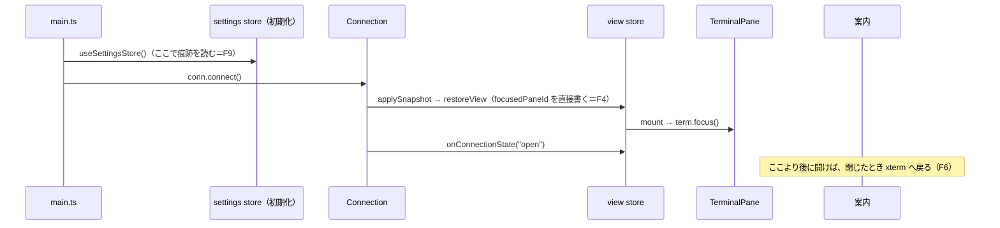

# 調査: 設定の onboarding（初回の案内。H25b）

herdr の一次資料は主エージェントが直読した（`requirements.md`「背景 / 課題」に file:line 付きで記載）。ここでは Web 版の既存実装と UI の規範を調べる。
パスは `packages/web/src/` からの相対。

## 調査の問い

- Q1: 既存のダイアログはどう開き・閉じ・フォーカスを扱うか（形の先例）。
- Q2: ダイアログが開いている間、キー・文字・クリックは端末や prefix へ漏れないか（AC-I5 の既存の仕組み）。
- Q3: 起動直後、`client.hello` による pane のフォーカスと案内のフォーカスはどう取り合うか（requirements の未確定事項）。
- Q4: 既存の利用者の判定に使う 3 つの痕跡は、初回の利用で書かれるか。ほかに使える／使えない痕跡は。
- Q5: テーマ・キーのプリセット・通知を「設定画面と同じ保存値」で反映する入口はどこか。
- Q6: OS 通知の許可と「OS の通知でも受け取れますか？」の案内（sticky トースト）はどう動くか。
- Q7: 設定画面から別のダイアログを開くとき、既存の流儀は。モバイルでの見え方は。
- Q8: UI の規範（WAI-ARIA APG の modal dialog・ネイティブの `<dialog>`・herdr）の開く／確定／取り消し／キーボード／フォーカス。
- Q9: コンポーネントテストの書き方（先例）。

## 判明した事実

- F1（Q1）: 既存のダイアログはすべて**ネイティブの `<dialog>` ＋ `showModal()`**。開閉は `view.dialogContext` を `watch` し、`kind` が一致したら
  `nextTick` の後に `showModal()` して中の要素へ `focus()`、それ以外なら `close()`（`components/SettingsDialog.vue:105-126`、
  `components/HelpDialog.vue` の `watch(() => view.dialogContext, …)`）。Esc で起きる `cancel` は `preventDefault()` して自前で
  `view.closeDialog()` を呼ぶ（`SettingsDialog.vue:505-509`・`HelpDialog.vue` の `onNativeCancel`）。設定画面は背景クリック（`@click.self`）でも
  閉じる（`SettingsDialog.vue:513`）。
- F2（Q1）: 開く・閉じるの状態は `view` ストアの `openDialogWithContext(ctx)`（開く前の pane を `preDialogFocusPaneId` に覚える）と
  `closeDialog()`（覚えた pane を `focusedPaneId` に戻す）（`store/view.ts:347-368`）。`DialogContext` は判別共用体で、種類を足すには
  型に 1 行足す（`store/view.ts:168-211`。設定は `{ kind: "settings" }`）。
- F3（Q2）: `view.openDialog` が非 null の間、`KeyRouter` のモードは `"dialog"`（`main.ts:265-268`）で、window の keydown の経路は何もしない
  （`main.ts:276`）。端末（xterm）へのキーは、`showModal()` で背景が inert になり xterm の textarea がフォーカスを持てないので届かない。
  背景の要素へのクリックも inert で届かない（HTML の modal dialog の性質。後述 F13）。
- F4（Q3）: 起動の順序は `Connection` が `store.applySnapshot(...)` → `store.onConnectionState("open")` の順に呼ぶ（`net/Connection.ts:239-242`）。
  `applySnapshot` の中で `view.restoreView(...)` が `focusedPaneId.value` を**直接**書き換える（`store/view.ts:308-322`。`focusPane` や
  `retargetPreDialogFocus` を通らない）。`TerminalPane` は mount 時と `focusedPaneId` の変化時に `term.focus()` する（`components/TerminalPane.vue:41-47,62-68`）。
- F5（Q3）: 開いている間の焦点の移し直しは `retargetPreDialogFocus` で行う決まり（`store/view.ts:354-361`、使う側 `store/StoreAdapter.ts:79-89`・
  `notify/NotificationController.ts:300-301`）。ただし `restoreView` はこの決まりの外にある（F4）。
- F6（Q3）: `closeDialog()` は覚えた pane を `focusedPaneId` に戻すだけで、値が変わらなければ `TerminalPane` の watch は発火しない。既存の
  ダイアログで閉じたあと端末に入力できるのは、**ネイティブの `<dialog>` が閉じるときに `showModal()` 直前のフォーカス（xterm の textarea）へ
  戻す**から（HTML の dialog の「previously focused element」。F13）。したがって**端末にフォーカスが入る前に開くと、閉じても body に残る**。
- F7（Q4）: 3 つの痕跡の書かれ方:
  - `wtm.hint.prefixHelp.v1`: 最初に pane へフォーカスが入ったとき、キー一覧の割り当てがあれば `"1"` を書く（`components/Toast.vue:14,35-45`。
    既定の割り当て `prefix+?` があるので、既定のままなら**初回の起動で必ず書かれる**）。
  - `wtm.prefs.v1`: 設定を 1 つでも変える・サイドバーの幅や折りたたみ・並び順を変える・通知の案内の印が立つ（`notifyHintPending`。最初の
    エージェントの出来事）と書かれる（書き手の一覧: `store/settings.ts`・`store/view.ts:88,117,131,486,496`・`store/notifications.ts:70,121,126`）。
  - `wtm.seen.v1`: エージェントの既読を進めたとき（`store/seen.ts:5,18-24`）。
- F8（Q4）: 使えない痕跡: `wtm.themeBoot.v1`（`theme/ThemeController.ts:12,158`）は `themeController.start()`（`main.ts:180`）が起動のたびに書く
  ので初回でも存在する。`wtm.view.v1` は `sessionStorage`（`store/view.ts:9,18,30`）でタブの寿命しか残らない。
- F9（Q4）: 判定の時機。`Toast.vue` の watch（`immediate`）は `focusedPaneId` が非 null になった瞬間（`client.hello` の後）に痕跡を書く。
  設定ストアは `main.ts` の冒頭で作られる（`useSettingsStore()` の初期化で `readPrefs()` を 1 回読む。`store/settings.ts:153-154`）。
  **痕跡の判定は store の初期化時（接続より前）に 1 回行えば、同じ起動の中で書かれた痕跡に惑わされない**。
- F10（Q4）: 読めない環境の先例。`Toast.vue:20-26` の `hasShownHint` は例外なら `true`（＝二度と邪魔しない側）。`readPrefs` は例外なら `{}`
  を返す（`store/view.ts:55-65`）——**`readPrefs` の戻り値だけでは「空」と「読めない」を区別できない**。
- F11（Q5）: 反映の入口（設定画面と同じ保存値になるもの）:
  - テーマ: `settings.setTheme(name)`（`store/settings.ts:323-327`。`theme`・`themeAuto: false` を書く）。選べる名前は `THEME_NAMES`、表示名は
    `THEME_LABELS`（`theme/themes.ts`。設定画面の使い方 `SettingsDialog.vue:1-14` の import）。既定は `DEFAULT_THEME_NAME`（`@wtm/protocol`）。
    自動の切替（`themeAuto`）は `setThemeAuto`。
  - キーのプリセット: `KEY_PRESETS`（`keys/presets.ts:44-51`。herdr のおすすめ〔ctrl+alt〕・tmux 風の 2 つ）を
    `applyRecommended(settings.keymap, settings.keyPrefs, preset.bindings)` → `settings.replaceKeyPrefs(r.prefs)`（設定画面の［足す］と同じ。
    `components/KeySettings.vue:427-443`、`keys/assign.ts:303-`）。**足す操作**で、衝突・予約は理由つきで `skipped` に返る。
  - 通知: `notifications.setPrefs({ toast, desktop, sound })`（`store/notifications.ts:67-71`。`notify` を丸ごと書く）。既定は
    `{ toast: true, desktop: false, sound: false }`（`notify/policy.ts:52`）。
- F12（Q6）: OS 通知は `controller.requestDesktopPermission()`（利用者の操作から呼ぶこと。`notify/NotificationController.ts:374-377`）で許可を求め、
  `granted` のときだけ `desktop: true`（設定画面 `SettingsDialog.vue:130-141`）。音は「入」にする操作の中で `controller.unlockSound()`
  （`SettingsDialog.vue:144-149`）。sticky の案内は `notifyHintDone` が true なら二度と出ない（`#armHint`・`showHintIfDue`・`#consumeHint`
  `NotificationController.ts:312-366`、印は `store/notifications.ts:48-50,119-127` の `setHintDone`）。`#consumeHint` は private なので、外から
  「案内を消費済み」にするには `notifications.setHintDone(true)`＋`setHintPending(false)` を呼ぶ。
- F13（Q8）: UI の規範。
  - WAI-ARIA APG「Dialog (Modal) Pattern」（https://www.w3.org/WAI/ARIA/apg/patterns/dialog-modal/ 、2026-09-26 取得）: 開いたらフォーカスは
    ダイアログの中の要素へ移る。Tab は中の要素だけを巡る。Escape で閉じる。**内容が大きいときは先頭の静的な要素（見出し等）に
    `tabindex="-1"` でフォーカスする**。閉じたら開いた要素へ戻す（その要素が無い、または流れとして別の場所が妥当なら別の場所）。
    `role="dialog"`・`aria-modal="true"`・`aria-labelledby`（見える見出し）。
  - ネイティブの `<dialog>` の `showModal()`: top layer に出し、背景を inert にする（フォーカス・クリックが背景へ届かない）。Esc は `cancel`
    を発火。閉じると開く直前にフォーカスしていた要素へ戻す（F6）。暗黙の role は dialog、modal なら aria-modal 相当。
  - herdr（requirements の背景）: 案内はモーダル。Esc は無視・外側のクリックも無視・続けるだけ。
  - 本製品の設定画面・キー一覧: 開くと中の最初の操作要素／一覧へフォーカス、Esc と［閉じる］と背景クリックで閉じる。
- F14（Q7）: 設定画面は 3 か所から開く（`ActionDispatcher.ts:163-165`〔`prefix+s`〕・`components/ContextMenu.vue:114`〔サイドバーのメニュー〕・
  `mobile/MobileShell.vue:87`〔上のバー〕）。ダイアログは同時に 1 つ（`openDialog` は 1 スロット）。設定画面は画面幅に合わせ
  `max-width: min(34em, calc(100% - 16px))`・`max-height: calc(100% - 16px)` でスクロールさせる（`SettingsDialog.vue:916-` の `.settings-dialog`）。
  モバイルには Esc が無いので画面上の［閉じる］を置く（`SettingsDialog.vue:514-518` のコメント）。
- F15（Q7）: 端末の種類は `inject(DeviceKindKey, "desktop")`（`SettingsDialog.vue:49-55`）。節「キー」はモバイルでも出し、取り込めない旨の一言を
  添える（`KeySettings.vue:46,481-483`）。
- F16（Q9）: コンポーネントテストは happy-dom（`vitest.config.ts`）。`<dialog>` の `showModal`/`close` を生やし、`createPinia()` と
  `NotificationControllerKey` の偽物を provide して `mount(..., { attachTo: document.body })`、`view.openDialogWithContext` のあと `$nextTick` 2 回
  （`SettingsDialog.test.ts:18-68`）。偽の controller は `requestDesktopPermission`・`unlockSound` を `vi.fn` で持つ。

## 影響範囲

- 新規: 案内のダイアログ（コンポーネント）と、その判定（純粋関数）。
- `store/view.ts` の `DialogContext` に 1 種類足す。
- `store/settings.ts`（または新しい小さなストア）に「案内を出すか」「案内済み」を持つ。
- `App.vue` にダイアログを 1 つ置く。
- `SettingsDialog.vue` に開き直す導線を足す。
- `notify` の印（`notifyHintDone`）に触る。
- docs: `docs/herdr-parity.md`・`docs/verification.md`。

## 実現性 / リスク

- 実現できる。既存の部品（`<dialog>`・ストアの setter・`applyRecommended`）で足りる。サーバ・protocol の変更は要らない。
- リスク: 起動直後のフォーカス（F4・F6）。端末にフォーカスが入る前に開くと、閉じたあと端末へ入力できない。
- リスク: `readPrefs` は「読めない」を `{}` で返す（F10）ので、判定に使うと読めない環境で毎回案内を出してしまう。判定では localStorage を
  直接 try/catch で読む必要がある。
- リスク: happy-dom は inert・フォーカスの戻り（F6）を再現しない見込み。テストでは `document.activeElement` の検証の範囲が限られる。

## 実装アンカー

- A1: ダイアログの種類（`store/view.ts:168-211` `DialogContext`）— `{ kind: "settings" }` の隣に足す。
- A2: 開閉と焦点（`store/view.ts:347-368` `openDialogWithContext`/`closeDialog`）。
- A3: 形の先例（`components/SettingsDialog.vue:105-126,505-518`、`components/HelpDialog.vue` の watch と `onNativeCancel`）。
- A4: 設定画面の配置（`App.vue:81-92`）— ダイアログの並び。
- A5: 痕跡のキー（`components/Toast.vue:14` `HINT_STORAGE_KEY`、`store/seen.ts:5` `STORAGE_KEY`、`store/view.ts:47` `PREFS_KEY`〔非 export〕）。
- A6: 反映（`store/settings.ts:323-333` `setTheme`/`setThemeAuto`、`:376-387` `replaceKeyPrefs`、`keys/assign.ts:303` `applyRecommended`、
  `keys/presets.ts:44` `KEY_PRESETS`、`store/notifications.ts:67` `setPrefs`・`:119-127` `setHintPending`/`setHintDone`）。
- A7: 通知の許可（`notify/NotificationController.ts:370-382` `desktopPermission`/`requestDesktopPermission`/`unlockSound`）。
- A8: 接続が開いた印（`view.connectionState`。`main.ts:255-259` が watch している）。
- A9: テストの先例（`components/SettingsDialog.test.ts:18-68`）。

## 実装時の注意

- `PREFS_KEY` は export されていない（`store/view.ts:47`）。痕跡の判定で生の文字列を読むなら、定数を export するか `view.ts` に判定用の関数を置く
  （読み書きの所有者を `view.ts` に集める方針 `store/view.ts:49-53`）。
- `readPrefs` の `{}` は「空」と「読めない」を区別しない（F10）。
- `restoreView` は `retargetPreDialogFocus` を通らない（F4）。案内を接続より前に開くと、開いている間に `focusedPaneId` が変わり、
  `TerminalPane` の `term.focus()` が走る（inert なので実ブラウザでは効かない見込みだが、閉じたあとの戻り先が body になる）。
- 設定画面の `@click.self="cancel"`（背景クリックで閉じる）を案内では使わない（requirements AC-I1）。
- `notifications.setPrefs` は `notify` を丸ごと書く。3 つとも既定と同じでも `notify` のキーが保存に現れる（既存の設定画面と同じ）。

## design への申し送り

- 開く時機は「接続が最初に `open` になり、端末にフォーカスが入った後」にする案が F4・F6 と整合する。
- 痕跡の判定は store 初期化時に 1 回、localStorage を直接読み、例外なら「出さない」。
- 案内の選択を「その場で反映（設定画面と同じ）」にするか「確定で反映」にするかは requirements の AC-I2（スキップで反映しない）から
  「確定で反映」になる。テーマのプレビューは要否を design で決める（プレビューするならスキップで元に戻す必要がある）。
- 開き直しの導線は設定画面の中に置けば、設定画面の 3 つの入口（F14）がそのまま使える。
- 通知の選択の確定で `notifyHintDone` を立てる（requirements AC9）。
