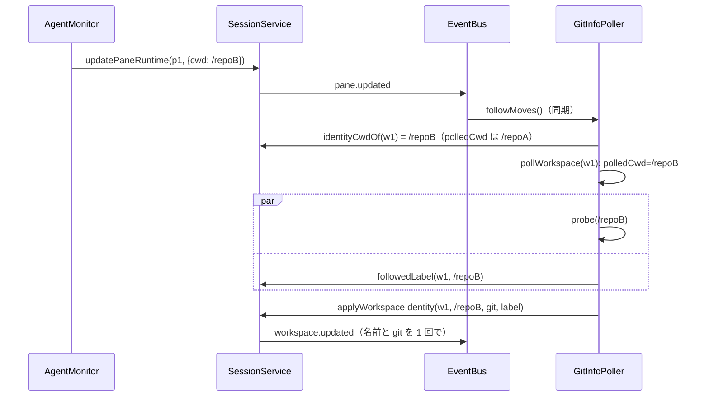

# 仕様: workspace の自動の名前と git の情報を、最初の pane のいまの場所に追従させる

## 概要

workspace の「いまの場所」を**最初の tab の最初の pane の `Pane.cwd`**（エージェントの監視が更新し続けている。research F1）と定め、
git の監視（`GitInfoPoller`）が 1 回の見直しの中で **その場所の git の情報と、同じ場所の自動の名前を一緒に**決めて、1 つの
`workspace.updated` で入れる。見直しは今の 5 秒の周期に加え、最初の pane の場所が変わったこと（バスのイベント）に気づいた時点でも行う。
名前を空にして確定したとき・復元のときの自動の名前も、同じ「いまの場所」から決める。開いた場所（`Workspace.cwd`）は変えない。

## 設計方針

- **D1 いまの場所は 1 か所の関数**（`SessionService.identityCwdOf`）。最初の tab（`tabIds[0]`）の `LayoutTree.leaves(layout)[0]` の pane の `cwd`。
  tab・pane が見つからなければ `Workspace.cwd`。herdr の `resolved_identity_cwd_from` に当たる（research F4）。根の pane を id で覚えない理由は decisions D2。
- **D2 名前と git を同じ見直しで決め、まとめて入れる**（herdr の `apply_workspace_git_statuses` と同じ形。research F4）。`GitInfoPoller.pollWorkspace` が
  場所を 1 度読み、`probe(cwd)` と `session.followedLabel(id, cwd)` を並べて待ち、`session.applyWorkspaceIdentity(id, cwd, git, label)` で入れる。
  入れる時点でいまの場所が `cwd` と違えば**両方とも捨てる**（AC6。新しい場所の見直しが別に走っている——D4）。
  - 退けた案: `SessionService.updatePaneRuntime` の中で名前を決め直し、git は監視に任せる——名前と git が別々の時刻・別々の場所で決まり、
    食い違う時間ができる（requirements のゴール「食い違わない」に反する）。また `updatePaneRuntime` は毎秒呼ばれる同期の処理（research「実装時の注意」）。
- **D3 名前は場所が変わったときだけ決め直す**（AC11）。`SessionService` が workspace ごとに「いまの自動の名前を決めた場所」（`labelCwd`）を持ち、
  `followedLabel` は `labelCwd` と同じ場所なら fs に問い合わせずに `null` を返す。作成・名前を空にして確定・復元・追従のそれぞれで、決めた場所を記録する。
  **止まった・遅い fs のためにフォルダ名で代えたかもしれないときは記録しない**——次の見直しでもう一度決め直す（AC15。research「実装時の注意」）。
  代えたかどうかは `autoLabelFor` が返す（`degraded`: 待つ前に `labelLookupsStuck > 0` だった、待っている間に上限超えが 1 件でも起きた〔`labelTimeouts` の
  数が進んだ〕、または reject した）。待ち終えた時点の `labelLookupsStuck` では判定しない（待つ間に詰まりが解けると、代えたフォルダ名を記録してしまう）。
- **D4 場所の変化にすぐ気づく**。`GitInfoPoller` に（省略できる引数で）バスを渡し、`pane.updated`・`pane.closed`・`layout.updated`・`tab.closed`・
  `workspace.updated`（「依拠する既存の事実」の最初の pane が代わる操作のイベント）を受けたら、見直した workspace ごとに「前回見直した場所」（`polledCwd`）といまの場所を比べ、違う workspace だけすぐ見直す。
  比べるのはメモリだけの同期の処理（research「リスク」）。herdr が OSC 7 を受けてすぐ取り直すのに当たる（research F4）。周期（5 秒）はそのまま。
  - 退けた案: 周期だけに頼る——requirements の上限（6 秒）は満たすが、`cd` から最大 6 秒遅れる。購読の費用は小さい。
- **D5 名前変更が勝つ**。追従の決め直しは名前変更の世代（`labelGen`）を**進めない**。待つ前の世代を持ち帰り、入れるときに世代が同じで、まだ自動の名前の
  ときだけ名前を入れる（前の work の design D9 の仕組みを流用。research F2・「リスク」）。
- **D6 開いた場所は変えない**（AC9）。新しい tab の代わり・既に開いているかの判定・保存は今までどおり `Workspace.cwd`（research F7）。~~worktree の一覧~~は
  review ラウンド 1 でいまの場所へ移した（いまの場所が使えなければ開いた場所。decisions D10）。
- **D7 保存の形は変えない**（AC14）。最初の pane の場所は既に保存にある（research F6）。

## 対象範囲

- `packages/server/src/session/SessionService.ts`: `identityCwdOf`・`followedLabel`・`applyWorkspaceIdentity`（新規）、`labelCwd` と後始末、作成・名前変更・復元の場所。
- `packages/server/src/git/GitInfoPoller.ts`: 対象の場所・バスの購読・まとめて入れる。
- `packages/server/src/composeServer.ts`: `GitInfoPoller` にバスを渡す。
- テスト: `SessionService.test.ts`・`GitInfoPoller.test.ts`。
- E2E の前提の直し: `packages/e2e/src/specs/workspace-auto-label.spec.ts`（走らせない。未検証の穴）。
- 文書: `docs/herdr-parity.md`（H01b）・`docs/verification.md`。
- protocol・web: 変更なし。

## 依拠する既存の事実

- `Pane.cwd` は監視が 0.5〜1 秒ごとに前面プロセスの cwd か OSC 7 で更新し、変わったときだけ `pane.updated` を出す（`AgentMonitor.ts:21-25`・`:169-190`、
  `SessionService.ts:694-724`）。
- 自動の名前は `SessionService.autoLabelFor`（`SessionService.ts:248-253`）で決め、上限超えの問い合わせが返るまでフォルダ名（`labelLookupsStuck`。`:111-116`・`:137-150`）。
- 名前変更の世代 `labelGen`（`SessionService.ts:117-120`・`:260-270`）、閉じたときの後始末 5 か所（`:310`・`:450`・`:506`・`:622`・`:657`）。
- git の監視は 5 秒ごとに全 workspace を `probe(ws.cwd)`（`GitInfoPoller.ts:46-62`。`probe` は git の外・時間切れ・git が無いとき `null`——`:66-67`・`:93-95`。design で確かめた）、作成の直後に `pollWorkspaceNow`（`surface/methods/workspace.ts:17-21`）、
  起動時は復元の後に `start()`（`composeServer.ts:265-276`）。コンストラクタ `(session, git, intervalMs)`（`GitInfoPoller.ts:26-30`）。
- `updateWorkspaceGit` は値が違うときだけ `workspace.updated`（`SessionService.ts:726-732`・`sameGit` `:959-967`）。
- 最初の pane が代わる操作とイベント（research F5）: pane を閉じる → `pane.closed`（＋最後の pane なら `tab.closed`）、入れ替え・端への移動・置き換え → `layout.updated`
  （`SessionService.ts:545-600` の `swapPane`・`swapPaneWith`・`moveToEdge`・`replacePane`）、別 tab・新しい tab へ動かす → 元の tab の `layout.updated` か `tab.closed`
  （`moveToTab`・`moveToNewTab`。research F5 の「別 tab へ動かす」を design で確かめ直した——`SessionService.ts:600-660`）、tab を閉じる → `tab.closed`、tab の並べ替え → `workspace.updated`（`:430-436`）。
- バスは同期で購読者を呼ぶ（`bus/EventBus.ts:9-22`）。
- 画面の並び順は `LayoutTree.leaves`（`LayoutTree.ts:16-19`）。
- 保存の pane は `cwd` を持ち、復元はそれを `Pane.cwd` に入れる（`persist/SessionFile.ts` の `SessionFilePaneSchema`、`SessionModel.ts:902-952`）。
- 復元の名前は `restoredLabel`（`SessionService.ts:872-876`）が `wsData.cwd` から決める。

## インターフェース / データ構造

```ts
// SessionService（すべて server 内部。protocol は変えない）
identityCwdOf(id: WorkspaceId): string | undefined;          // 無い workspace は undefined
interface FollowedLabel { label: string; gen: number; degraded: boolean }
followedLabel(id: WorkspaceId, cwd: string): Promise<FollowedLabel | null>;
  // 無い・付けた名前・labelCwd === cwd なら null（fs に問い合わせない）。投げない。
applyWorkspaceIdentity(id: WorkspaceId, cwd: string, git: GitInfo | null, label: FollowedLabel | null): void;
  // identityCwdOf(id) !== cwd なら何もしない。名前（自動・世代が同じとき）と git を入れ、変わっていれば workspace.updated を 1 回。
private readonly labelCwd: Map<WorkspaceId, string>;          // いまの自動の名前を決めた場所
private forgetWorkspace(id: WorkspaceId): void;               // labelGen と labelCwd を消す（閉じた 5 か所）
private labelTimeouts: number;                                // 上限超えの累計（onTimeout で進める。degraded の判定用）
private autoLabelFor(cwd): Promise<{ label: string; autoLabel: true; degraded: boolean }>; // degraded を足す（D3）

// GitInfoPoller
constructor(session: SessionService, git: GitRunner, intervalMs = DEFAULT_INTERVAL_MS, bus?: EventBus);
private readonly polledCwd: Map<WorkspaceId, string>;         // 前回見直した場所
```

## 振る舞いの詳細



- `pollWorkspace(ws)`: `cwd = session.identityCwdOf(ws.id) ?? ws.cwd` を読み、**await の前に** `polledCwd.set(ws.id, cwd)`（同じ変化で重ねて見直さない）。
  `Promise.all([probe(cwd), session.followedLabel(ws.id, cwd).catch(() => null)])` の後、`session.applyWorkspaceIdentity(...)`。
- `followMoves()`（バスの購読）: `polledCwd` の各 workspace で `identityCwdOf` を読み、`undefined`（閉じた）なら消し、違えば `pollWorkspaceNow`。
  `pollNow()`（周期）も、いない workspace の `polledCwd` を消す（バスを渡さないときの後始末）。
  まだ見直していない workspace（作成の直後・起動の直後）は、作成の `pollWorkspaceNow`・`start()` の 1 周が見直す。
- `followedLabel(id, cwd)`: ws が無い・`!ws.autoLabel`・`labelCwd.get(id) === cwd` なら `null`。そうでなければ `gen = labelGen.get(id) ?? 0` を持ち、
  `autoLabelFor(cwd)` を待ち、`{ label, gen, degraded }`（`degraded` は `autoLabelFor` が返したもの。D3）を返す。
- `applyWorkspaceIdentity(id, cwd, git, label)`: ws が無い、または `identityCwdOf(id) !== cwd` なら何もしない。`label` があり、`ws.autoLabel` で世代が `label.gen` と
  同じなら: `degraded` でなければ `labelCwd.set(id, cwd)`、`degraded` なら `labelCwd.delete(id)`（次の見直しで決め直す）。名前が違えば
  `model.renameWorkspace(id, label.label, true)` と保存の予約。git が `sameGit` でなければ `model.updateWorkspaceGit`。どちらかが変わったら `workspace.updated` を 1 回。
- 作成: 自動の名前で作り `degraded` でなければ、commit の後に `labelCwd.set(id, resolvedCwd)`（最初の pane の場所＝開いた場所）。
- 名前変更: 自動の名前に戻すときは `identityCwdOf(id)` から決める（AC7）。**待っている間に場所が変わったら、新しい場所で決め直す**（最大 3 回。AC6——
  古い場所の名前で、監視が入れた新しい場所の名前と git を上書きしない。3 回を超えたら名前は入れず、`autoLabel` だけ true にして監視に任せる）。入れるとき、自動で `degraded` でなく、決めた場所がいまの場所と同じなら
  `labelCwd.set(id, その場所)`、そうでなければ `labelCwd.delete(id)`（次の見直しで決め直す）。付けた名前なら `labelCwd.delete(id)`。
- 復元: `restoredLabel` は保存の最初の tab の `leaves(layout)[0]` の pane の `cwd`（見つからなければ `wsData.cwd`）から決める（AC8）。自動の名前でフォルダ名に
  代えなかったものだけ `labelCwd` に記録する（復元の合計の期限切れと、`autoLabelFor` が返す `degraded`〔D3〕のときは記録しない）。git は今までどおり `start()` の 1 周（`pollWorkspace` がいまの場所で取る）。
- 閉じた workspace: `labelGen.delete` の 5 か所を `forgetWorkspace` に置き換える。
- 名前が決まるまでは前の名前のまま（requirements の herdr との違い）。

## ドメイン固有の考慮

- 3 つの OS: いまの場所は既存の `Pane.cwd`（Linux は前面プロセス、macOS・Windows は OSC 7。知らせなければ開いた場所のまま）。パスの比較は文字列の
  完全一致（`Pane.cwd` は監視が同じ形で入れ続けるので、同じ場所なら同じ文字列）。
- 負荷: 名前のための fs の問い合わせは場所が変わったときだけ（D3）。git は周期＋場所が変わったときに 1 回（D4）。
- 保存: 形は変えない（D7）。名前が変わったら今までどおり保存を予約する（名前は保存にある）。

## エラー処理 / 異常系

| 場面 | 扱い |
|---|---|
| 見直しの間に場所が変わった | `applyWorkspaceIdentity` が捨てる。変化はバスで気づいて新しい場所で見直す |
| 見直しの間に名前変更が来た | 世代が違うので名前は捨て、git だけ入れる（場所が同じなら） |
| 見直しの間に workspace が閉じた | 何もしない。`polledCwd` は次の `followMoves` か周期の `pollNow` で消える |
| 名前を空にして確定した待ちの間に場所が変わった | 新しい場所で決め直す（最大 3 回。超えたら名前は入れず、`autoLabel` だけ true にして `labelCwd` を消す——次の周期の見直しが名前を決める） |
| 名前を決める fs が止まる・遅い | 前の work の上限どおりフォルダ名。`labelCwd` を記録せず次の見直しで決め直す（AC15） |
| git が無い・時間切れ | 今までどおり `probe` が `null`（git の情報を消す） |
| `followedLabel` が万一 reject | `null` として git だけ入れる |

## 受け入れ基準との対応

- AC1: `pane.updated`（入力: `AgentMonitor` が入れた最初の pane の `Pane.cwd`）→ `followMoves` → `pollWorkspace` が同じ場所で `probe` と `followedLabel` →
  `applyWorkspaceIdentity`（D2・D4）。OSC 7 を知らせないシェルでは `Pane.cwd` が変わらないので開いた場所のまま。
- AC2: 同上。git の外なら `probe` が `null`、名前は `autoLabelFor` のフォルダ名の規則（入力: 同上）。
- AC3: `followedLabel` が付けた名前で `null` を返し、git だけ入る（入力: `Workspace.autoLabel === false`）。
- AC4: `identityCwdOf` は最初の tab の最初の pane だけを見る。ほかの pane の `pane.updated` では `polledCwd` と同じなので見直さない（入力: ほかの pane の `Pane.cwd`）。
- AC5: 閉じる・入れ替え・tab を閉じる・並べ替えのイベントで `followMoves` が新しい最初の pane の場所に気づく（入力: research F5 のイベント）。
- AC6: `applyWorkspaceIdentity` がいまの場所と違う結果を捨てる（D2。入力: 見直しを始めた場所 `cwd`）。
- AC7: `renameWorkspace(id, null)` が `identityCwdOf` から決める（入力: 名前を空にした要求と最初の pane の場所）。
- AC8: `restoredLabel` が保存の最初の pane の `cwd` から決め、`start()` の 1 周が同じ場所で git を取る（入力: `session.json` の pane の `cwd`）。
- AC9: `Workspace.cwd` を書き換える処理を足さない（D6。入力: なし——既存の読み手 research F7 が今までどおり読む）。
- AC10: 変化は既存の `workspace.updated` で全ブラウザへ配られる（入力: `applyWorkspaceIdentity` の発行）。
- AC11: `labelCwd` と同じ場所なら `followedLabel` が fs に問い合わせない。git は周期と `followMoves` の変化時だけ（D3・D4。入力: `labelCwd`・`polledCwd`）。
- AC12: `docs/herdr-parity.md` の H01b の違い①を書き換える（入力: requirements の「herdr との違い」）。
- AC13: `docs/verification.md` の自動の名前の説明と確かめ方を直す（入力: この design の振る舞い）。
- AC14: 保存の形を変えない（D7。入力: 以前の版の `session.json`）。
- AC15: `degraded` のとき `labelCwd` を記録せず、次の見直しで決め直す（D3。入力: `autoLabelFor` が返す `degraded`——`labelLookupsStuck`・`labelTimeouts`・reject から決まる）。
