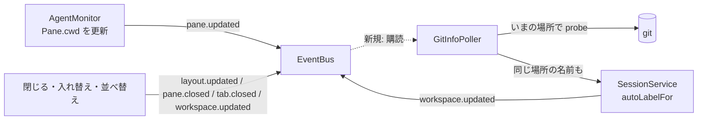

# 調査: workspace の自動の名前と git の情報を、最初の pane のいまの場所に追従させる

## 調査の問い

- Q1: pane の「いまの場所」は、サーバのどこに・いつ・どの頻度で入っているか（新しい仕組みが要るか）。
- Q2: 自動の名前は今どこで決め、名前変更との競合をどう防いでいるか。止まったファイルシステムへの配慮はどこにあるか。
- Q3: git の情報は今どこで・どの頻度で取り、どこで反映しているか。
- Q4: herdr はいつ・どの場所から名前と git を決め直し、古い結果をどう捨てているか。
- Q5: 「最初の tab の最初の pane」が代わる操作は何で、それぞれサーバでどのイベントが出るか。
- Q6: 復元のとき、最初の pane の場所は保存に入っているか。
- Q7: 開いた場所（`Workspace.cwd`）を読んでいる箇所（変えてはいけない利用者）。
- Q8: 既存のテスト・E2E で、この変更で前提が崩れるもの。

## 判明した事実

- F1（Q1）: エージェントの監視が pane ごとに周期的に（出力があれば 0.5 秒、無ければ 1 秒ごと。`AgentMonitor.ts:21-25`・`:122-142`）前面プロセスを
  調べ、`leader?.cwd ?? host.mirror.cwdHint()` を `Pane.cwd` に入れる（`AgentMonitor.ts:169-190`）。Linux は前面プロセスグループの先頭の cwd、
  macOS・Windows ネイティブは OSC 7（`cwdHint`）。値が変わったときだけ `pane.updated` を出し、保存を予約する（`SessionService.ts:694-724`）。
  → **新しい仕組みは要らない**。`Pane.cwd` がそのまま「いまの場所」。
- F2（Q2）: 自動の名前の規則は `workspaceLabel.ts` の `autoWorkspaceLabel`（上限 200ms。`AUTO_LABEL_TIMEOUT_MS`）。`SessionService.autoLabelFor`
  （`SessionService.ts:248-253`）が呼び、上限を超えた問い合わせが返るまで（`labelLookupsStuck > 0`）は fs に問い合わせずフォルダ名にする
  （`:111-116`・`:137-150`）。名前変更は世代（`labelGen`。`:117-120`）を進め、自動の名前に戻す待ちから戻ったとき世代が変わっていれば捨てる
  （`:260-270`）。閉じた workspace の世代は 5 か所で消す（`:310`・`:450`・`:506`・`:622`・`:657`）。
  作成は `resolvedCwd`（`:218`）、名前変更は `ws.cwd`（`:264`）、復元は `wsData.cwd`（`:872-876`）から決めている。
- F3（Q3）: `DefaultGitInfoPoller`（`GitInfoPoller.ts`）は 5 秒ごと（`DEFAULT_INTERVAL_MS`）に全 workspace を `probe(ws.cwd)` し（`:46-62`）、
  `session.updateWorkspaceGit` が値の違うときだけ `workspace.updated` を出す（`SessionService.ts:726-732`・`sameGit` `:959-967`）。作成の直後は
  `workspace.create` の処理が `pollWorkspaceNow` を呼ぶ（`surface/methods/workspace.ts:17-21`）。起動時は復元の後に `start()`（`composeServer.ts:275`）
  がすぐ 1 周する（`GitInfoPoller.ts:35-41`）。コンストラクタは `(session, git, intervalMs)`（`:26-30`）でバスを持たない。git の問い合わせは 1 回の
  probe で 3〜4 本（`:64-96`）。
- F4（Q4）: herdr は周期（1.5 秒。`src/app/mod.rs:39`）の git の取り直しで、workspace ごとに `resolved_identity_cwd_from`（最初の tab の根の pane の
  `cwd_for_pane`。無ければ開いた場所。`src/workspace.rs:1011-1020`）を対象にする（`src/app/git_refresh.rs:117-135`）。結果を入れるときに場所が
  変わっていれば捨て、変わっていなければ自動の名前・ブランチ・リポジトリの情報をまとめて入れ替える（`src/app/actions.rs:1392-1440`）。
  OSC 7 で場所を知らされるとすぐ取り直す（`src/app/api.rs:338-339`）。リポジトリの判定のやり直しは 5 分ごとか取り直しを要求されたとき
  （`src/app/mod.rs:40`・`git_refresh.rs:46-50`）。表示は、場所がまだ取り直していない場所なら先にフォルダ名（`src/workspace.rs:1063-1069`）。
  `cwd_for_pane` は OSC 7 で知らされた場所、無ければシェル（子プロセス）の cwd（`src/pane.rs:3466-3478`）。根の pane は閉じたときだけ残りの先頭に代わる
  （`src/workspace/tab.rs:459-524`）。開いた場所 `identity_cwd` は追従で書き換えない（書き換えはテストと worktree の作成だけ——`grep identity_cwd =`）。
- F5（Q5）: 最初の pane が代わりうる操作と、出るイベント:
  - pane を閉じる・入れ替える（`swapPane`/`swapPaneWith`）・端へ動かす（`moveToEdge`）・置き換える（`replacePane`）・別 tab へ動かす → `layout.updated`
    か `pane.closed`（`SessionService.ts:545-600` ほか）。
  - tab を閉じる → `tab.closed`。tab を並べ替える（`moveTab`）→ `workspace.updated`（`:430-436`）。
  - 最初の pane の場所が変わる → `pane.updated`（F1）。
  バスは同期で購読者を呼ぶ（`bus/EventBus.ts:9-22`）。`AgentMonitor` は `bus.subscribe` で購読している（`AgentMonitor.ts:81`）。
  画面の並び順は `LayoutTree.leaves`（`LayoutTree.ts:16-19`。`a` を先に、`b` を後に）。
- F6（Q6）: `session.json` の pane は `cwd` を持ち（`persist/SessionFile.ts` の `SessionFilePaneSchema`。以前の版から必須）、`AgentMonitor` が
  変えた `Pane.cwd` が保存される（`SessionService.ts:723` の `persist.touch`）。復元は `SessionModel.restoreWorkspace`（`SessionModel.ts:902-952`）が
  pane の `cwd` をそのまま入れる。tab の `layout` も保存されている。→ 最初の tab の最初の pane の場所は、以前の版の保存からも取れる。
- F7（Q7）: `Workspace.cwd` を読むのは、新しい tab を開く場所の代わり（`SessionService.ts:392`）・worktree の一覧を取るリポジトリ
  （`WorktreeService.ts:98-101`）・既に開いているかの判定（web `ActionDispatcher.ts:284`・`:304`）・保存（`composeServer.ts:340`）・git の監視
  （`GitInfoPoller.ts:60`）・名前変更（`SessionService.ts:264`）。変えるのは最後の 2 つだけ。
- F8（Q8）:
  - E2E `packages/e2e/src/specs/workspace-auto-label.spec.ts:86-134` は、既定の workspace の最初の pane で `cd '${sub}'` してから新しい workspace を作り、
    サイドバーが `[defaultName, name]` になることを見る。**追従すると既定の workspace の名前も `name` に変わり、この前提が崩れる**。
    `new-terminal-cwd.spec.ts:76` も `cd` するが workspace の名前を見ない（`spaceLabels` を使うのは auto-label と workspace-tab-pane の 2 本だけで、
    後者は `cd` しない）。
  - 単体: `GitInfoPoller.test.ts` は `defaultCwd` のリポジトリで作った workspace を見る（pane の場所＝開いた場所なので前提は崩れない）。
    `SessionService.test.ts` の名前変更のテスト（`:1360-1470` 付近）は pane の場所を変えない。

## 影響範囲

- server: `GitInfoPoller.ts`（対象の場所・購読）・`SessionService.ts`（最初の pane の場所・名前の決め直し・名前変更・復元）・`composeServer.ts`（バスを渡す）。
- protocol・web: 変更なし（`Workspace.label`・`Workspace.git` をそのまま読む）。
- E2E: `workspace-auto-label.spec.ts` の 1 本目の前提（F8）。
- 文書: `docs/herdr-parity.md:24`（H01b）・`docs/verification.md:63-69`・`:234-245`。

## 実現性 / リスク

- 実現できる。新しい依存は無い。
- リスク: 名前変更（`labelGen`）・作成・追従の決め直しが同じ workspace で重なる。追従の決め直しは世代を**進めず**、待ちの前後で世代が同じときだけ
  入れれば、名前変更が勝つ（F2 の仕組みを流用）。
- リスク: `pane.updated` は題名・busy の変化でも出る（F1）。購読の中で重い処理をすると全部の出力に効く。比較は同期でメモリだけにする。

## 実装アンカー

- A1: 最初の pane の場所（新規）— `SessionService`（`SessionModel.getWorkspace/getTab/getPane` と `Layout.leaves`。`SessionService.ts` は既に `LayoutTree`
  を import しているかは未確認——coding で確かめる）。
- A2: 追従の決め直し（新規）— `SessionService.autoLabelFor`（`SessionService.ts:248-253`）を使う。
- A3: 名前変更で自動の名前に戻す場所 — `SessionService.renameWorkspace`（`:260-270`）の `ws.cwd`。
- A4: 復元の名前 — `SessionService.restoredLabel`（`:872-876`）の `wsData.cwd`。
- A5: git の対象の場所 — `DefaultGitInfoPoller.pollWorkspace`（`GitInfoPoller.ts:59-62`）。
- A6: バスを渡す — `composeServer.ts:189` の `new DefaultGitInfoPoller(session, gitRunner)`。
- A7: 閉じた workspace の後始末 — `labelGen.delete` の 5 か所（F2）。
- A8: E2E の前提 — `workspace-auto-label.spec.ts:103-108`。
- A9: 単体テストの足場 — `SessionService.test.ts:100-108`（`fakeLabelDeps`）・`GitInfoPoller.test.ts:17-80`（実物の git で作る足場）。

## 実装時の注意

- `SessionService.updatePaneRuntime` は AgentMonitor から毎秒呼ばれる。ここに await を足さない（同期のまま）。
- 作成の順序（名前を決めてから予約と起動。前の work の decisions D1）を変えない。作成のときは pane の場所＝開いた場所なので、追従は作成の後の
  監視で始まればよい。
- `labelLookupsStuck` の間に決めたフォルダ名は「決め直し済み」と記録しない（AC15。記録すると場所が変わるまで二度と決め直さない）。
- `GitInfoPoller` のコンストラクタは既存のテストが 2〜3 引数で呼ぶ。バスは省略できる形で足す。
- prettier: `GitInfoPoller.ts`・`SessionService.ts` が HEAD で整形済みかは coding で確かめてから `--write` を使う（多くは未整形）。

## design への申し送り

- 名前と git を**同じ場所の結果として**入れる置き場（1 つの `workspace.updated` にまとめるか、2 つに分けるか）。
- 場所の変化にすぐ気づく経路（バスの購読）を入れるか、周期だけにするか。requirements の「6 秒以内」は周期だけでも満たす（監視 1 秒＋git 5 秒）が、
  herdr は OSC 7 ですぐ取り直す。
- E2E の 1 本目の直し方（既定の workspace の最初の pane ではない pane で `cd` する等）。E2E は走らせない方針なので未検証の穴として残す。
