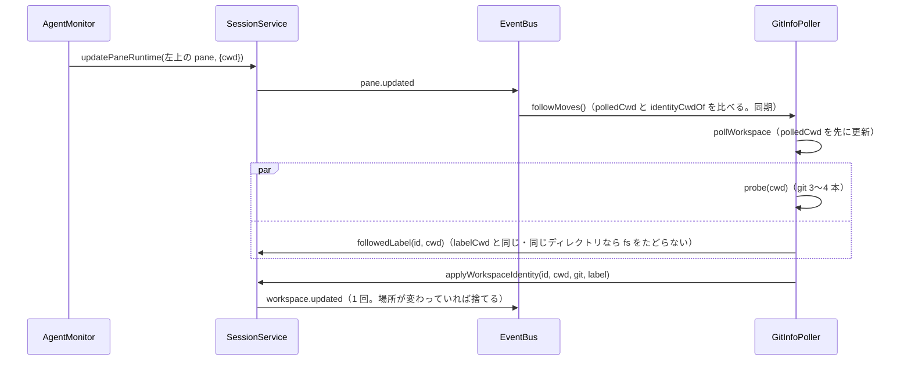

# レビューガイド: workspace の名前と git の情報を、最初の pane のいまの場所に追従させる

## 変更概要 / 目的
名前を付けていない workspace の自動の名前と、サイドバーの git の情報（ブランチ・ahead/behind・worktree の自動グループの判定）を、herdr と同じく
「最初の tab の最初の（左上の）pane のいまの場所」から決める。以前はどちらも開いた場所（`Workspace.cwd`）のままで、`cd` しても変わらなかった。
worktree の一覧・作成・削除も同じ場所のリポジトリで行う（review ラウンド 1。decisions D10）。

## 重要ポイント
- **いまの場所は 1 か所**: `SessionService.identityCwdOf`（`packages/server/src/session/SessionService.ts` の `identityCwdOf`）。出所は既存の監視が
  更新する `Pane.cwd`（新しい仕組みは足していない）。根の pane を id で覚えない理由は decisions D2。
- **名前と git は同じ見直しでまとめて入れる**: `GitInfoPoller.pollWorkspace` が場所を 1 度読み、`probe` と `followedLabel` を並べ、
  `applyWorkspaceIdentity` がいまの場所が変わっていれば両方捨てる（design D2）。
- **名前は場所が変わったときだけ決め直す**: `labelCwd`（決めた場所）。フォルダ名で代えたかもしれない名前は記録しない（`degraded`。design D3）。
  リンクを含む論理パスと実パスは realpath で同じと見る（D11）。
- **名前変更が勝つ**: 追従は `labelGen` を進めず、待つ前の世代と同じときだけ入れる（design D5）。名前を空にした待ちの間に場所が動いたら決め直す。
- **保存の tab の並び**を `ws.tabIds` の順にした（`composeServer.ts` の `toSessionFileData`。D8）。以前からの欠落でもある。

## 処理フロー

## 主要な変更箇所
- `packages/server/src/session/SessionService.ts` — `identityCwdOf`・`followedLabel`・`applyWorkspaceIdentity`・`sameDir`・`forgetWorkspace`、
  `autoLabelFor` の `degraded`、`renameWorkspace`（いまの場所から・決め直し）、`restoredLabel`＋`savedIdentityCwd`（保存の左上の pane）。
- `packages/server/src/git/GitInfoPoller.ts` — `FOLLOW_EVENTS` の購読・`followMoves`・`pollWorkspace`。
- `packages/server/src/git/WorktreeService.ts` — `cwdOf` がいまの場所（使えなければ開いた場所）。
- `packages/server/src/session/workspaceLabel.ts` — `WorkspaceLabelDeps.realpath`。
- `packages/server/src/composeServer.ts` — バスを渡す・保存の tab の並び。
- `packages/e2e/src/specs/workspace-auto-label.spec.ts` — 左上の pane を動かさない形へ（走らせていない）。
- `docs/herdr-parity.md`（H01b・H20）・`docs/verification.md`。

## リスク / 確認したい点
- E2E は走らせていない（利用者の方針）。ブラウザでの見え方は未確認。`workspace-auto-label.spec.ts` の直しは読解だけ。
- herdr との違い（根の pane の選び方・いまの場所の出所・決まるまでの表示）は対応表に書いた。
- テストで捕まえられない変異（`pane.closed`・`tab.closed` の購読、待ち終える前に詰まりが解ける順序）は decisions D6・D7。
